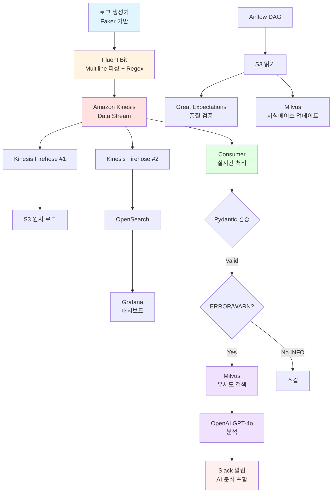

# CALI 프로젝트 아키텍처 및 데이터 흐름 Overview

> **작성일**: 2026-01-23  
> **작성자**: CALI 프로젝트 팀

---

## 📋 **프로젝트 개요**

**프로젝트명**: CALI (Cloud-native AI Log Insight)

**목적**: AWS EKS 환경의 비정형 로그를 실시간으로 정제하고, RAG 기반 AI 분석을 통해 장애 원인을 자동으로 추론하여 MTTR(평균 복구 시간)을 단축하는 AIOps 플랫폼

**핵심 가치**:
- 비정형 로그의 실시간 정제 및 구조화
- AI 기반 지능형 장애 원인 추론
- OpenSearch 기반 시각화 및 검색
- 자동화된 데이터 품질 관리

---

## 🔄 **전체 데이터 흐름**



---

## 📊 **단계별 데이터 변환**

| **단계** | **처리 주체** | **입력** | **출력** | **설명** |
|---------|------------|--------|--------|---------|
| **1. 원본 로그** | App Pod | 원시 텍스트 | `[ERROR] payment-api: DB Connection timeout at 14:00:01` | 비정형 로그 발생 |
| **2. 1차 정형화** | Fluent Bit | 원시 텍스트 | `{"timestamp": "14:00:01", "level": "ERROR", "service": "payment", ...}` | Multiline 파싱 + Regex 헤더 추출 |
| **3. 스트림 버퍼** | Kinesis Stream | JSON | JSON (Fan-out) | 중앙 버퍼, 다중 Consumer 지원 |
| **4. 검증** | Consumer | JSON | Pydantic 검증 객체 | 타입 안전성 확보 |
| **5. 필터링** | Consumer | 모든 로그 | ERROR/WARN만 선별 | 중요 로그 집중 처리 |
| **6. RAG 검색** | Milvus | ERROR 로그 벡터 | 유사 사례 Top-K | 과거 장애 사례 검색 |
| **7. AI 분석** | OpenAI GPT-4o | 에러 + 유사 사례 | `{"cause": "DB 과부하", "action": "커넥션 풀 상향"}` | 원인 분석 + 조치 방안 |
| **8. 최종 알림** | Slack | AI 분석 결과 | 🚨 [장애] payment-api 에러 발생 (과거 사례 95% 일치) + 조치 가이드 | Throttling 적용 |

---

## 🏗️ **시스템 아키텍처 (레이어별)**

### **1. 데이터 수집 계층 (Ingestion Layer)**

#### **Fluent Bit DaemonSet**
- **배포 위치**: EKS 각 노드
- **주요 기능**:
  - **Multiline Parser**: Java/Python 스택 트레이스 15-30줄을 하나로 묶음
  - **Regex 헤더 추출**: `timestamp`, `level`, `service` 필드 파싱
  - **Kinesis Output**: 정제된 JSON 로그 전송
- **설정 파일**: `fluent-bit.conf`, `parsers.conf`

---

### **2. 스트리밍 계층 (Streaming Layer)**

#### **Amazon Kinesis Data Stream**
- **역할**: 중앙 버퍼 및 Fan-out 허브
- **구성**:
  - 샤드 1개, 확장 가능
  - 24시간 데이터 보존
- **Fan-out 아키텍처**:
  - Consumer #1: 실시간 처리 애플리케이션
  - Consumer #2: Firehose → S3 백업
  - Consumer #3: Firehose → OpenSearch 인덱싱

#### **Kinesis Data Firehose (2개)**
- **Firehose #1 → S3**: 장기 보관 및 배치 처리용
- **Firehose #2 → OpenSearch**: 실시간 인덱싱 및 검색용

---

### **3. 실시간 처리 계층 (Real-time Processing)**

#### **Consumer 애플리케이션** (EKS Pod)

**기술 스택**: Python 3.1x, boto3, Pydantic

**처리 흐름**:
```python
while True:
    # 1. Kinesis Stream 폴링
    records = kinesis_client.get_records(ShardIterator='...')
    
    for record in records:
        # 2. Pydantic 스키마 검증
        try:
            log_entry = LogRecord(**json.loads(record))
        except ValidationError:
            # DLQ로 전송 x
            #send_to_dlq(record)
            continue
        
        # 3. 레벨 필터링
        if log_entry.level not in ['ERROR', 'WARN']:
            continue  # INFO 로그 스킵
        
        # 4. S3 백업 x
        #backup_to_s3(log_entry)
        
        # 5. OpenSearch 인덱싱 x
        #index_to_opensearch(log_entry)
        
        # 6. RAG 분석 (ERROR만)
        if log_entry.level == 'ERROR':
            # Milvus 유사도 검색
            similar_cases = milvus.search(log_entry.embedding)
            
            # 추가 작업 rag에 없는 에러 처리
            ...

            # OpenAI API 호출
            analysis = openai.analyze(log_entry, similar_cases)
            
            # Slack 알림 (Throttling 적용)
            send_to_slack(log_entry, analysis)

```

**주요 기능**:
- **Pydantic 검증**: 타입 안전성, 필수 필드 검증
- **ERROR/WARN 필터링**: 리소스 효율화
- **Throttling**: 동일 에러 5분 내 1회만 알림
- (추가)**Rag에 없는 에러 처리**: 이것을 s3로 저장해서 추후 rag 업데이트에 활용 

---

### **4. AI/RAG 계층 (AI & RAG Layer)**

#### **Milvus Vector DB** (EKS Standalone)

**역할**: 과거 장애 사례 지식 베이스

**구성**:
- **컬렉션 스키마**:
  - `id`: 로그 고유 ID
  - `embedding`: OpenAI Embedding 벡터 (1536 차원)
  - `log_content`: 원본 로그 텍스트
  - `service`: 서비스명
  - `timestamp`: 발생 시간
  - `resolution`: 해결 방법 (메타데이터)

**처리 흐름**:
```
1. 신규 ERROR 로그 발생
2. OpenAI Embedding API로 벡터화
3. Milvus.search(vector, top_k=5)
4. 유사도 점수 상위 5개 추출
5. OpenAI에게 컨텍스트로 제공
```

#### **OpenAI GPT-4o API**

**역할**: 지능형 원인 분석 및 조치 권고

**프롬프트 구조**:
```
시스템: 당신은 클라우드 인프라 장애 분석 전문가입니다.

유저:
현재 발생한 에러:
{current_error}

과거 유사 사례:
{similar_cases}

위 정보를 바탕으로:
1. 장애 원인 분석
2. 즉각 조치 방안
3. 재발 방지 가이드
를 JSON 형식으로 제시해주세요.
```

**응답 예시**:
```json
{
  "cause": "DB 커넥션 풀 고갈 (동시 요청 급증)",
  "immediate_action": "1. DB 커넥션 풀 크기 증가 (20→50)\n2. 타임아웃 설정 조정 (5s→10s)",
  "prevention": "Auto Scaling 정책 강화, Circuit Breaker 패턴 적용",
  "confidence": 0.92
}
```

---

### **5. 저장 및 시각화 계층 (Storage & Visualization)**

#### **Amazon S3**

**버킷 구조**:
```
s3://cali-logs/
├── raw/                    # 원본 로그 백업
│   └── dt=2026-01-23/
│       └── logs.json
├── processed/              # DAG: S3 로그 품질 체크
│   └── dt=2026-01-23/
└── new_errors/             # RAG에 없는 새로운 에러 (Consumer가 저장, Airflow가 읽어서 Milvus 업데이트)
    └── dt=2026-01-23/
        └── unknown_errors.json

```

**활용**:
- 장기 보관 (Glacier로 자동 전환)
- Airflow 배치 처리 소스
- 데이터 품질 검증 대상

#### **Amazon OpenSearch Service**

**인덱스 매핑**:
```json
{
  "mappings": {
    "properties": {
      "timestamp": { "type": "date" },
      "level": { "type": "keyword" },
      "service": { "type": "keyword" },
      "message": { "type": "text" },
      "trace_id": { "type": "keyword" },
      "stack_trace": { "type": "text" }
    }
  }
}
```

**활용**:
- 전문 검색 (Full-text Search)
- 시계열 분석
- Grafana 데이터 소스

#### **Grafana Dashboard**

**대시보드 구성**:
1. **실시간 에러 현황**
   - 시간별 에러 발생 추이 (선 그래프)
   - 서비스별 에러 분포 (파이 차트)

2. **로그 레벨 통계**
   - ERROR, WARN, INFO 비율 (막대 그래프)
   - 임계값 알림 설정

3. **최근 에러 로그 목록**
   - 실시간 로그 스트림 (테이블)
   - Slack 알림 이력

---

### **6. 배치 처리 계층 (Batch Processing)**

#### **Apache Airflow** (LocalExecutor)

**DAG #1: Milvus 지식베이스 업데이트**
```python
@dag(schedule='0 2 * * *')  # 매일 02:00
def update_milvus_knowledge():
    # 1. S3에서 전날 로그 읽기
    logs = read_s3_logs(date='{{ ds }}')
    
    # 2. ERROR 로그만 필터링
    error_logs = filter_errors(logs)
    
    # 3. OpenAI Embedding 생성
    embeddings = generate_embeddings(error_logs)
    
    # 4. Milvus 적재
    insert_to_milvus(embeddings)
```

**DAG #2: 데이터 품질 검증**
```python
@dag(schedule='0 3 * * *')  # 매일 03:00
def data_quality_check():
    # 1. S3 로그 읽기
    logs = read_s3_logs(date='{{ ds }}')
    
    # 2. Great Expectations Suite 실행
    results = ge_suite.validate(logs)
    
    # 3. 검증 실패 시 Slack 알림
    if not results.success:
        send_slack_alert(results)
```

#### **Great Expectations**

**검증 룰 예시**:
```python
# expectation_suite.json
{
  "expectations": [
    {
      "expectation_type": "expect_column_values_to_not_be_null",
      "kwargs": {"column": "timestamp"}
    },
    {
      "expectation_type": "expect_column_values_to_be_in_set",
      "kwargs": {
        "column": "level",
        "value_set": ["ERROR", "WARN", "INFO", "DEBUG"]
      }
    },
    {
      "expectation_type": "expect_column_values_to_match_regex",
      "kwargs": {
        "column": "service",
        "regex": "^[a-z-]+$"
      }
    }
  ]
}
```

---

### **7. 알림 계층 (Notification Layer)**

#### **Slack Webhook**

**알림 유형**:

**1. 기본 ERROR 알림**:
```
🚨 [ERROR] payment-api
시간: 2026-01-23 14:00:01
메시지: DB Connection timeout
서비스: payment-api
Trace ID: abc-123-def
```

**2. AI 분석 포함 알림**:
```
🚨 [장애 분석] payment-api

📌 발생 내용:
DB Connection timeout (14:00:01)

🔍 AI 분석 결과:
원인: DB 커넥션 풀 고갈 (동시 요청 95% 급증)
유사 사례 일치율: 92%

✅ 즉각 조치:
1. DB 커넥션 풀 크기 증가 (20→50)
2. 타임아웃 설정 조정 (5s→10s)

🛡️ 재발 방지:
- Auto Scaling 정책 강화
- Circuit Breaker 패턴 적용

📊 [대시보드 보기] | 📝 [로그 상세]
```

**Throttling 로직**:
```python
# 5분 내 동일 에러는 1회만 알림
cache_key = f"{service}:{error_hash}"
if redis.exists(cache_key):
    return  # 스킵
redis.setex(cache_key, 300, "1")  # 5분 TTL
send_to_slack(message)
```

---

## ⚙️ **주요 아키텍처 설계 원칙**

### **1. Fan-out 최적화**
- **원칙**: Fluent Bit은 Kinesis Stream으로만 단순 전송
- **이유**: 
  - Fluent Bit 설정 단순화
  - Consumer에서 유연한 라우팅
  - 새로운 Consumer 추가 용이

### **2. Consumer 중심 필터링**
- **원칙**: Fluent Bit은 모든 로그 전송, Consumer에서 필터링
- **이유**:
  - 필터링 로직 변경 용이
  - 디버깅 및 감사 추적 가능

### **3. 비동기 처리**(추가 기능)
- **원칙**: RAG 분석은 비동기로 처리
- **이유**:
  - 로그 수집 파이프라인 블로킹 방지
  - OpenAI API 응답 지연 영향 최소화
  - Slack 알림 성능 보장

장점:
- Consumer는 계속 Kinesis 폴링 가능  
- RAG 분석은 별도 워커가 처리  
- OpenAI API 느려도 로그 수집은 멈추지 않음  
- 처리량: 초당 수백 개 가능  

---

## 🛠️ **기술 스택 상세**

### **Infrastructure**
| 구분 | 기술 | 용도 |
|-----|------|-----|
| IaC | Terraform | 인프라 코드 관리 |
| 컨테이너 | AWS EKS | Kubernetes 오케스트레이션 |
| 스트리밍 | Kinesis Stream | 실시간 데이터 버퍼 |
| 스트리밍 | Kinesis Firehose | S3/OpenSearch 전달 |
| 저장소 | Amazon S3 | 객체 스토리지 |
| 검색 | OpenSearch | 로그 인덱싱 및 검색 |
| 네트워크 | VPC, Security Group | 네트워크 격리 |
| 권한 | IAM | 접근 제어 |
| 시크릿 | Secrets Manager | 민감 정보 관리 |

### **Data Pipeline**
| 구분 | 기술 | 용도 |
|-----|------|-----|
| 로그 수집 | Fluent Bit | 경량 로그 수집기 |
| 언어 | Python 3.13 | Consumer 애플리케이션 |
| 검증 | Pydantic | 스키마 검증 |
| AWS SDK | boto3 | Kinesis/S3 연동 |
| 테스트 데이터 | Faker | 로그 생성기 |

### **AI & Analytics**
| 구분 | 기술 | 용도 |
|-----|------|-----|
| Vector DB | Milvus | 유사도 검색 |
| LLM | OpenAI GPT-4o | 지능형 분석 |
| Embedding | OpenAI Embedding | 텍스트 벡터화 |
| 검색 엔진 | OpenSearch | 전문 검색 |
| 시각화 | Grafana | 대시보드 |

### **Orchestration & Quality**
| 구분 | 기술 | 용도 |
|-----|------|-----|
| 워크플로우 | Apache Airflow | 배치 처리 오케스트레이션 |
| 데이터 품질 | Great Expectations | 데이터 검증 |

---

## 👥 **역할 분담 (4인 체제)**

| 역할 | 담당 영역 | 주요 책임 |
|------|----------|----------|
| **역할 1: 인프라** | Terraform, AWS 리소스 | EKS, Kinesis, S3, OpenSearch, Firehose 구축 및 관리 |
| **역할 2: 실시간 파이프라인** | Fluent Bit, 시각화 | 로그 수집, OpenSearch 인덱싱, Grafana 대시보드 |
| **역할 3: 배치 파이프라인** | Airflow, 데이터 품질 | DAG 작성, Great Expectations 검증 |
| **역할 4: Consumer + RAG** | 실시간 처리, AI | Kinesis 폴링, Pydantic 검증, **전체 RAG 구축** (Milvus + OpenAI) |

---

## 📅 **5일 개발 일정**

### **Day 1: MVP - 전체 연결** ⚡

**목표**: 각 컴포넌트를 "일단 연결"만 해서 데이터가 흐르는지 확인

#### **역할 1: 인프라**
- [ ] Terraform으로 AWS 인프라 배포
  - VPC, Security Group
  - Kinesis Data Stream (샤드 1개)
  - Kinesis Data Firehose (S3 + OpenSearch)
  - S3 버킷 (raw/, new_errors/)
  - OpenSearch 도메인 (t3.small)
  - Secrets Manager (Slack Webhook, OpenAI Key)
- [ ] IAM Role/Policy 설정
- [ ] 배포 완료 후 접근 정보 공유

**완료 기준**: `terraform apply` 성공, 모든 리소스 접근 가능

---

#### **역할 2: 실시간 파이프라인**
- [ ] **로그 생성기 작성** (Python Faker, ERROR/WARN/INFO 3가지만)
- [ ] **Fluent Bit 기본 설정**
  - 로그 파일 읽기
  - 단순 JSON 변환 (헤더 추출 X, Multiline X)
  - Kinesis Output 연결
- [ ] **Grafana 배포** (Docker Compose 또는 AWS)
- [ ] **OpenSearch 데이터 소스 연결**
- [ ] **초단순 대시보드** (로그 테이블 1개만)

**완료 기준**: 로그 생성 → Fluent Bit → Kinesis → S3 + OpenSearch → Grafana에서 보임

---

#### **역할 3: 배치 파이프라인**
- [ ] **Airflow LocalExecutor 배포** (Docker Compose)
- [ ] Web UI 접근 확인 (localhost:8080)
- [ ] **초단순 DAG 1개**: S3 raw/ 파일 리스트 출력만
- [ ] 스케줄러 동작 확인

**완료 기준**: Airflow UI 접근 가능, DAG 실행 성공

---

#### **역할 4: Consumer + RAG**
- [ ] **Consumer 기본 구현**
  - boto3로 Kinesis GetRecords 폴링
  - **Pydantic 스키마 기본** (timestamp, level, message만)
  - **ERROR만 필터링** (WARN, INFO는 스킵)
- [ ] **Slack Webhook 기본 연동**
  - 단순 텍스트 알림만 (AI 분석 X, 포맷팅 X)
  - 예: `🚨 [ERROR] 에러 발생: {message}`
- [ ] Throttling 없이 모든 ERROR 전송

**완료 기준**: ERROR 로그 발생 → Consumer → Slack 알림 도착

---

#### **오후: 통합 테스트**
```
로그 생성기 실행
  ↓
Fluent Bit
  ↓
Kinesis
  ↓
├─ Firehose → S3 (파일 생성 확인)
├─ Firehose → OpenSearch → Grafana (테이블에 보임)
└─ Consumer → Slack (단순 알림)
```

**Day 1 완료 기준**: 위 전체 흐름이 동작함 (디테일은 부족해도 OK)

---

### **Day 2: 기능 고도화 #1** 🚀

**목표**: 각 컴포넌트의 품질을 높이고 RAG 준비

#### **역할 1: 인프라**
- [ ] **EKS 클러스터 생성** (Terraform)
  - Node Group 설정 (t3.medium 2-3대)
  - kubectl 설정
- [ ] **Fluent Bit DaemonSet 배포**
  - 역할 2가 작성한 설정 파일 적용
  - ConfigMap 설정
- [ ] **Consumer 애플리케이션 배포**
  - 역할 4 Docker 이미지 빌드 지원
  - Deployment/Service YAML 작성
  - ConfigMap/Secret 설정 (Kinesis ARN, Slack Webhook 등)
  - Pod 정상 동작 확인
- [ ] **Airflow 배포** (선택사항)
  - Helm Chart 또는 Deployment
  - 역할 3와 협업

**완료 기준**: EKS에서 모든 애플리케이션 정상 동작, 로그 수집 흐름 유지

---

#### **역할 2: 실시간 파이프라인**
- [ ] **Fluent Bit 고도화**
  - Multiline Parser 추가 (Java/Python stacktrace)
  - Regex 헤더 추출 (timestamp, level, service)
- [ ] **로그 생성기 개선**
  - 8종 에러 시나리오 추가
  - 실제와 유사한 패턴 (Faker)
- [ ] **Grafana 대시보드 2-3개 추가**
  - 시간별 에러 추이 (선 그래프)
  - 서비스별 로그 레벨 분포 (파이 차트)
  - 최근 ERROR 목록 (테이블)

---

#### **역할 3: 배치 파이프라인**
- [ ] **DAG #1: 데이터 품질 검증**
  - Great Expectations 설정
  - S3 raw/ 샘플링 (10%)
  - 기본 검증 룰 5개 (필수 필드, 타입, 값 범위)
  - 검증 실패 시 Slack 알림
- [ ] **DAG #2 골격**: S3 new_errors/ → Milvus (아직 실행 X)

---

#### **역할 4: Consumer + RAG**
- [ ] **Milvus 구축**
  - Standalone 배포 (역할 1 협업)
  - 컬렉션 스키마 설계
  - 초기 지식 데이터 5-10개 수동 입력
- [ ] **Consumer Pydantic 스키마 고도화**
  - 필드 추가 (service, trace_id, stack_trace 등)
  - 검증 실패 처리 (로그만, DLQ는 나중에)
- [ ] **Slack 알림 고도화**
  - 포맷팅 (Markdown)
  - Throttling 로직 추가 (5분 내 중복 방지)
- [ ] **OpenAI Embedding API 연동 테스트**

**Day 2 완료 기준**: RAG 기반 빼고 모든 기능 정교화 완료

---

### **Day 3: RAG 실시간 분석 완성** 🤖

**목표**: AI 분석을 추가하여 진짜 CALI 완성

#### **역할 1: 인프라**
- [ ] **ECR 리포지토리 생성**
  - Consumer 이미지용
  - 필요시 다른 컴포넌트용
- [ ] **GitHub Actions 워크플로우 작성**
  ```yaml
  1. 코드 푸시
  2. Docker 이미지 빌드
  3. ECR 푸시
  4. EKS 배포 (kubectl apply)
  5. Slack 알림 (배포 성공/실패)
  ```
- [ ] **HPA (Horizontal Pod Autoscaler) 설정**
  - Consumer Pod CPU 기반 Auto Scaling
  - 최소 2, 최대 10
- [ ] **리소스 최적화**
  - Resource Requests/Limits 설정
  - Spot Instance 활용 검토
- [ ] EKS 클러스터 최종 점검

**완료 기준**: GitHub 푸시 → 자동 빌드 → EKS 배포 파이프라인 동작, Auto Scaling 테스트 완료

---

#### **역할 2: 실시간 파이프라인**
- [ ] Grafana 알림 규칙 추가
- [ ] 대시보드 템플릿화
- [ ] Fluent Bit 리소스 최적화

---

#### **역할 3: 배치 파이프라인**
- [ ] **DAG #2 완성**: S3 new_errors/ → Milvus 업데이트
  - 새 에러 읽기
  - OpenAI Embedding 생성 (역할 4 코드 재사용)
  - Milvus 적재
- [ ] DAG 스케줄링 설정 (일 1회)
- [ ] 두 DAG 통합 테스트

---

#### **역할 4: Consumer + RAG** (가장 중요!)
- [ ] **Milvus 유사도 검색 구현**
  - 신규 ERROR 로그 벡터화
  - Top-5 유사 사례 검색
- [ ] **OpenAI GPT-4o 분석 연동**
  - 프롬프트 작성 (현재 에러 + 유사 사례 → 원인 + 조치)
  - API 호출 및 응답 파싱
- [ ] **Slack AI 알림 완성**
  ```
  🚨 [장애 분석] payment-api
  
  📌 발생 내용: DB Connection timeout
  
  🔍 AI 분석:
  원인: DB 커넥션 풀 고갈
  유사도: 92%
  
  ✅ 조치 방안:
  1. 커넥션 풀 크기 증가
  2. 타임아웃 조정
  ```
- [ ] **RAG에 없는 에러 처리**
  - 유사도 < 70% → S3 new_errors/에 저장
  - 기본 알림만 전송

**Day 3 완료 기준**: ERROR → AI 분석 Slack 알림 완벽 동작

---

### **Day 4: E2E 테스트 + 안정화** ✅

**전체 협업**
- [ ] **E2E 테스트** (전체 10단계)
  1. 시작 → 로그 생성기 실행 (ERROR 로그 발생)
  2. Fluent Bit이 수집하는지 확인
  3. Kinesis Stream에 전송되는지 확인
  4. Firehose가 S3에 저장하는지 확인
  5. Firehose가 OpenSearch에 인덱싱하는지 확인
  6. Consumer가 폴링하는지 확인
  7. Pydantic 검증 통과하는지 확인
  8. Milvus 검색이 동작하는지 확인
  9. OpenAI 분석 결과가 나오는지 확인
  10. 끝 → Slack에 알림이 도착하는지 확인
- [ ] **성능 테스트** (대량 로그, Throttling 확인)
- [ ] **에러 시나리오 테스트**
  - 잘못된 포맷
  - Milvus 검색 결과 없음
  - OpenAI API 실패
- [ ] **버그 수정 및 튜닝**

**역할별 개선**:
- **역할 1: 인프라**
  - [ ] 인프라 모니터링 (AWS 콘솔 메트릭만, CloudWatch 대시보드 X)
  - [ ] 비용 확인 및 최적화
  - [ ] 팀원 이슈 지원 (권한, 네트워크 등)
  - [ ] Terraform 코드 정리 및 문서화
- **역할 2**: Grafana 알림 임계값 조정
- **역할 3**: Airflow DAG 최적화
- **역할 4**: RAG 프롬프트 튜닝

---

### **Day 5: 프로덕션 배포 + 문서화** 📦

**배포 작업** (역할 1 + 4):
- [ ] Consumer Docker 이미지 빌드
- [ ] ECR Push
- [ ] EKS Deployment YAML
- [ ] CI/CD 파이프라인 완성

**문서화** (전체):
- [ ] README
- [ ] 운영 가이드
- [ ] API 문서

**역할 1 추가 작업**:
- [ ] 배포 가이드 작성
- [ ] 인프라 아키텍처 다이어그램 업데이트

**최종 검증**:
- [ ] 프로덕션 시뮬레이션
- [ ] 팀 데모

---

## 🎯 **성공 기준**

### **기술적 KPI**
- [ ] 로그 처리 Latency < 5초
- [ ] Slack 알림 도달률 > 99%
- [ ] RAG 분석 정확도 (주관 평가) > 80%
- [ ] 시스템 가용성 > 99%

### **비즈니스 KPI**
- [ ] MTTR 단축 효과 입증
- [ ] 팀 내부 사용자 만족도 향상
- [ ] 확장 가능한 아키텍처 구현

---

*최종 업데이트: 2026-01-23*  
*작성자: CALI 프로젝트 팀*
