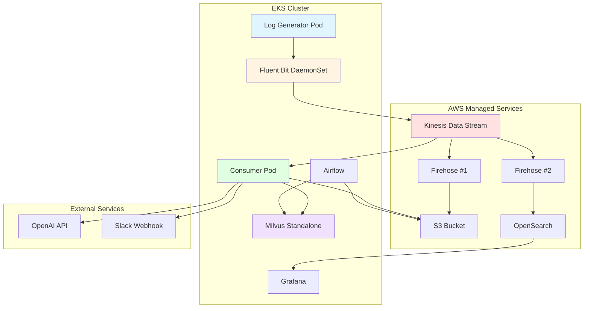
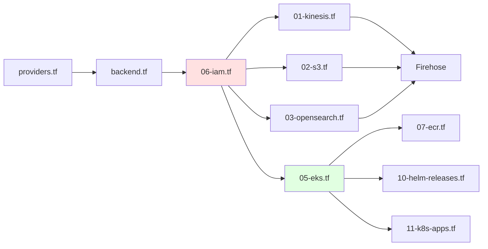
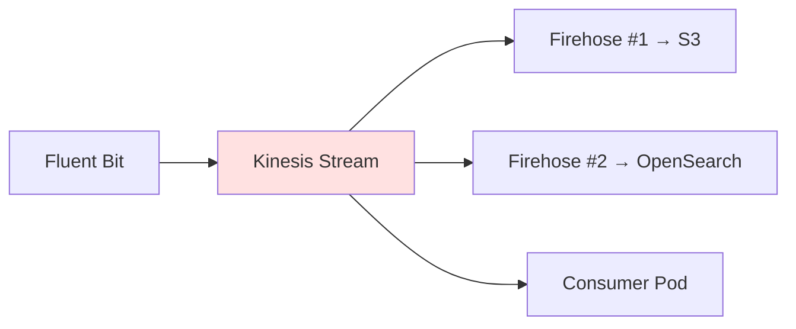
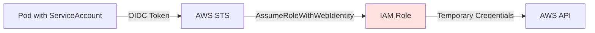

# CALI 인프라 구축 기술 발표

> **발표자**: 인프라 담당 (역할 1)  
> **프로젝트**: CALI (Cloud-native AI Log Insight)  
> **발표일**: 2026-01-31

---

## 📌 목차

1. [프로젝트 개요](#1-프로젝트-개요)
2. [인프라 아키텍처 설계](#2-인프라-아키텍처-설계)
3. [핵심 기술 스택](#3-핵심-기술-스택)
4. [Infrastructure as Code (IaC) 전략](#4-infrastructure-as-code-iac-전략)
5. [주요 AWS 리소스 구성](#5-주요-aws-리소스-구성)
6. [IAM 권한 설계](#6-iam-권한-설계)
7. [Kubernetes 배포 전략](#7-kubernetes-배포-전략)
8. [기술적 의사결정과 해결 과제](#8-기술적-의사결정과-해결-과제)
9. [성과 및 결론](#9-성과-및-결론)

---

## 1. 프로젝트 개요

### CALI란?

**Cloud-native AI Log Insight** - AWS EKS 환경의 비정형 로그를 실시간으로 정제하고, RAG 기반 AI 분석을 통해 장애 원인을 자동으로 추론하는 AIOps 플랫폼

### 인프라 담당 역할

- **완전 자동화된 IaC 구축** (Terraform)
- **고가용성 데이터 파이프라인** 설계 (Kinesis, Firehose)
- **보안 우선 IAM 정책** 설계 (Least Privilege)
- **GitOps 기반 CI/CD** 파이프라인 구축

---

## 2. 인프라 아키텍처 설계

### 전체 시스템 구성도



### 아키텍처 설계 원칙

| 원칙 | 설명 | 구현 방식 |
|------|------|----------|
| **확장성** | 트래픽 증가 시 자동 확장 | EKS Auto Scaling, Kinesis 샤드 확장 |
| **고가용성** | 단일 장애점 제거 | Multi-AZ, Kinesis 24시간 보존 |
| **보안 우선** | Least Privilege 원칙 | IRSA, IAM Role 세분화 |
| **비용 최적화** | 필요 리소스만 프로비저닝 | t3.medium, S3 Lifecycle, Spot 검토 |
| **관찰 가능성** | 모든 계층 로깅 및 모니터링 | CloudWatch, OpenSearch, Grafana |

---

## 3. 핵심 기술 스택

### Infrastructure Layer

| 영역 | 기술 | 선택 이유 |
|------|------|----------|
| **IaC** | Terraform 1.0+ | 선언적 인프라 관리, AWS Provider 5.0 |
| **Container Orchestration** | Amazon EKS 1.29 | 관리형 Kubernetes, AWS 통합 우수 |
| **Streaming** | Kinesis Stream + Firehose | 완전 관리형, Fan-out 아키텍처 지원 |
| **Storage** | S3 + OpenSearch | 장기 보관 + 실시간 검색 |
| **Container Registry** | ECR | Private, EKS 네이티브 통합 |

### Platform Layer

| 영역 | 기술 | 배포 방식 |
|------|------|----------|
| **로그 수집** | Fluent Bit | Helm Chart (DaemonSet) |
| **벡터 DB** | Milvus Standalone | Helm Chart (Stateful) |
| **워크플로우** | Apache Airflow | Helm Chart + Custom Image |
| **시각화** | Grafana | Helm Chart |

---

## 4. Infrastructure as Code (IaC) 전략

### Terraform 파일 구조

```
infra/terraform/
├── providers.tf           # AWS/Helm/K8s Provider 설정
├── backend.tf            # State 관리 (S3 + DynamoDB)
├── 01-kinesis.tf         # Stream + Firehose 2개
├── 02-s3.tf              # 로그 저장소
├── 03-opensearch.tf      # 검색 엔진
├── 04-grafana.tf         # 시각화 (주석 처리, Helm으로 이전)
├── 05-eks.tf             # EKS 클러스터 + Node Group
├── 06-iam.tf             # 모든 IAM Role/Policy
├── 07-ecr.tf             # Container Registry + Auto Build
├── 08-autoscaler.tf      # Cluster Autoscaler
├── 09-storage-class.tf   # K8s Storage Class (gp2)
├── 10-helm-releases.tf   # Helm 배포 (Airflow, Milvus, etc.)
├── 11-k8s-apps.tf        # Consumer, Log Generator
└── outputs.tf            # 팀원 공유용 출력값
```

### 작업 순서 (의존성 고려)



> [!IMPORTANT]
> **IAM 리소스(06-iam.tf)를 가장 먼저 생성**해야 다른 리소스들이 참조 가능

### 주요 설정값

| 리소스 | 설정 | 비고 |
|--------|------|------|
| **Kinesis Stream** | 샤드 1개, 24시간 보존 | PROVISIONED 모드 |
| **Firehose #1** | → S3 raw/ (버퍼 60초, GZIP) | 장기 백업 |
| **Firehose #2** | → OpenSearch (버퍼 60초) | 실시간 인덱싱 |
| **OpenSearch** | t3.small.search, 1 노드, 20GB gp3 | Fine-Grained Access Control |
| **EKS** | 1.29, t3.medium, min 2 / max 4 | ON_DEMAND |
| **S3 Lifecycle** | 30일 → IA, 90일 → Glacier, 365일 삭제 | 비용 최적화 |

---

## 5. 주요 AWS 리소스 구성

### 5.1 Kinesis Data Streaming

#### Architecture Pattern: Fan-out



**설계 의도**:
- **단일 진입점**: Fluent Bit은 Kinesis Stream으로만 전송
- **유연한 확장**: 새로운 Consumer 추가 용이
- **데이터 보존**: 24시간 버퍼로 재처리 가능

#### Kinesis Stream 설정

```hcl
resource "aws_kinesis_stream" "logs" {
  name             = "cali-logs-stream"
  shard_count      = 1
  retention_period = 24
  
  stream_mode_details {
    stream_mode = "PROVISIONED"
  }
}
```

#### Firehose 설정 (S3)

```hcl
extended_s3_configuration {
  bucket_arn = aws_s3_bucket.logs.arn
  prefix     = "raw/dt=!{timestamp:yyyy-MM-dd}/"
  
  buffering_size     = 5      # MB
  buffering_interval = 60     # seconds
  compression_format = "GZIP"
}
```

> [!TIP]
> **버퍼링 전략**: 60초 또는 5MB 중 먼저 도달하는 조건으로 전송 → 비용 절감

---

### 5.2 Amazon S3

#### 버킷 구조

```
s3://cali-logs-<account-id>/
├── raw/                          # Firehose #1 → 원본 로그
│   └── dt=2026-01-31/
│       └── logs-*.json.gz
├── new_errors/                   # Consumer → RAG에 없는 에러
│   └── dt=2026-01-31/
│       └── unknown_errors.json
└── firehose-failed/              # Firehose 실패 시
    └── *.json.gz
```

#### 보안 설정

| 기능 | 설정 | 목적 |
|------|------|------|
| **Versioning** | Enabled | 실수로 삭제된 객체 복구 |
| **Encryption** | SSE-S3 (AES256) | 저장 데이터 암호화 |
| **Public Access** | 전체 차단 | 외부 노출 방지 |
| **Lifecycle** | 30일 → IA, 90일 → Glacier | 비용 최적화 |

---

### 5.3 Amazon OpenSearch

#### 클러스터 구성

```hcl
cluster_config {
  instance_type  = "t3.small.search"
  instance_count = 1
  zone_awareness_enabled = false
}

ebs_options {
  ebs_enabled = true
  volume_type = "gp3"
  volume_size = 20
}
```

#### Fine-Grained Access Control (FGAC)

```hcl
advanced_security_options {
  enabled                        = true
  internal_user_database_enabled = true
  
  master_user_options {
    master_user_name     = "admin"
    master_user_password = var.opensearch_master_password
  }
}
```

> [!WARNING]
> **FGAC 활성화 시 주의**: IAM Role만으로 접근 불가, Security Plugin에 Role Mapping 필요

#### 해결 방법: Terraform Provisioner

```hcl
resource "null_resource" "opensearch_mapping" {
  provisioner "local-exec" {
    interpreter = ["PowerShell", "-Command"]
    command = <<EOT
      kubectl run os-mapping-job --image=curlimages/curl --restart=Never --command -- curl -k -u admin:${var.opensearch_master_password} -X PATCH "https://${aws_opensearch_domain.logs.endpoint}/_plugins/_security/api/rolesmapping/all_access" -H "Content-Type: application/json" -d '[...]'
    EOT
  }
}
```

**동작 원리**:
1. Terraform이 OpenSearch 생성 후
2. kubectl로 임시 Pod 생성
3. curl로 Security Plugin API 호출
4. Firehose/Grafana IAM Role을 `all_access` 그룹에 매핑

---

### 5.4 Amazon EKS

#### 클러스터 설정

```hcl
resource "aws_eks_cluster" "main" {
  name     = "cali-cluster"
  version  = "1.29"
  
  access_config {
    authentication_mode = "API_AND_CONFIG_MAP"
    bootstrap_cluster_creator_admin_permissions = true
  }
  
  enabled_cluster_log_types = ["api", "audit", "authenticator"]
}
```

#### Node Group 설정

```hcl
instance_types = ["t3.medium"]
capacity_type  = "ON_DEMAND"

scaling_config {
  desired_size = 2
  min_size     = 2
  max_size     = 4
}
```

> [!NOTE]
> **Spot Instance 미사용 이유**: Airflow, Milvus 같은 Stateful 워크로드는 중단 시 데이터 손실 위험

#### 팀원 접근 권한 (EKS Access Entry)

```hcl
resource "aws_eks_access_entry" "team_members" {
  for_each      = toset(var.team_members_arns)
  cluster_name  = aws_eks_cluster.main.name
  principal_arn = each.value
  type          = "STANDARD"
}

resource "aws_eks_access_policy_association" "team_members_admin" {
  for_each   = toset(var.team_members_arns)
  policy_arn = "arn:aws:eks::aws:cluster-access-policy/AmazonEKSClusterAdminPolicy"
  # ...
}
```

**장점**: `terraform.tfvars`에 IAM ARN만 추가하면 자동 권한 부여

---

### 5.5 Amazon ECR

#### 3개 리포지토리 생성

```hcl
resource "aws_ecr_repository" "consumer" {
  name                 = "cali/consumer"
  image_tag_mutability = "MUTABLE"
  force_delete         = true
  
  image_scanning_configuration {
    scan_on_push = true
  }
}
```

| 리포지토리 | 용도 | 자동 빌드 |
|------------|------|----------|
| `cali/consumer` | 실시간 로그 처리 | ❌ (GitHub Actions) |
| `cali/log-generator` | 테스트용 로그 생성 | ❌ (GitHub Actions) |
| `cali/airflow-custom` | Airflow + 커스텀 패키지 | ✅ (Terraform Provisioner) |

#### Airflow 이미지 자동 빌드

```hcl
resource "null_resource" "airflow_custom_build" {
  triggers = {
    dockerfile_hash   = filemd5("../../apps/airflow/Dockerfile")
    requirements_hash = filemd5("../../apps/airflow/requirements.txt")
  }
  
  provisioner "local-exec" {
    interpreter = ["PowerShell", "-Command"]
    command = <<EOT
      aws ecr get-login-password --region ap-northeast-2 | docker login --username AWS --password-stdin ...
      docker build -t ${aws_ecr_repository.airflow_custom.repository_url}:latest ../../apps/airflow
      docker push ${aws_ecr_repository.airflow_custom.repository_url}:latest
    EOT
  }
}
```

**장점**: `terraform apply` 시 Airflow 이미지 자동 빌드/푸시

---

## 6. IAM 권한 설계

### Least Privilege 원칙

> [!CAUTION]
> **절대 사용 금지**: `AdministratorAccess`, `*` 권한

### 6.1 IAM 역할 목록

| 역할 이름 | Principal | 용도 |
|-----------|-----------|------|
| `cali-eks-cluster-role` | eks.amazonaws.com | EKS Control Plane |
| `cali-eks-node-role` | ec2.amazonaws.com | Worker Node (EC2) |
| `cali-firehose-role` | firehose.amazonaws.com | S3/OpenSearch 전송 |
| `cali-app-role` | IRSA (consumer-sa) | Consumer Pod |
| `cali-cluster-autoscaler-role` | IRSA (cluster-autoscaler) | Auto Scaling |
| `cali-grafana-role` | IRSA (grafana) | OpenSearch 읽기 |
| `cali-airflow-role` | IRSA (airflow-*) | S3 읽기/쓰기 |

### 6.2 IRSA (IAM Roles for Service Accounts)

#### 구조



#### 설정 예시 (Consumer)

**1. OIDC Provider 생성**

```hcl
resource "aws_iam_openid_connect_provider" "eks" {
  client_id_list  = ["sts.amazonaws.com"]
  thumbprint_list = [data.tls_certificate.eks.certificates[0].sha1_fingerprint]
  url             = aws_eks_cluster.main.identity[0].oidc[0].issuer
}
```

**2. IAM Role with OIDC Trust**

```hcl
resource "aws_iam_role" "app_role" {
  assume_role_policy = jsonencode({
    Statement = [{
      Action = "sts:AssumeRoleWithWebIdentity"
      Principal = {
        Federated = aws_iam_openid_connect_provider.eks.arn
      }
      Condition = {
        StringEquals = {
          "${replace(aws_iam_openid_connect_provider.eks.url, "https://", "")}:sub" = "system:serviceaccount:default:consumer-sa"
        }
      }
    }]
  })
}
```

**3. Kubernetes ServiceAccount**

```hcl
resource "kubernetes_service_account" "consumer_sa" {
  metadata {
    name      = "consumer-sa"
    namespace = "default"
    annotations = {
      "eks.amazonaws.com/role-arn" = aws_iam_role.app_role.arn
    }
  }
}
```

**장점**:
- ✅ Pod에 AWS Credentials 하드코딩 불필요
- ✅ 역할별 세분화된 권한
- ✅ 임시 자격 증명 (자동 갱신)

---

### 6.3 주요 IAM 정책

#### Kinesis Access (Fluent Bit, Consumer)

```json
{
  "Version": "2012-10-17",
  "Statement": [{
    "Effect": "Allow",
    "Action": [
      "kinesis:PutRecord",
      "kinesis:PutRecords",
      "kinesis:GetRecords",
      "kinesis:GetShardIterator",
      "kinesis:DescribeStream"
    ],
    "Resource": "arn:aws:kinesis:ap-northeast-2:*:stream/cali-*"
  }]
}
```

#### S3 Workload Access (Airflow, Consumer)

```json
{
  "Statement": [{
    "Effect": "Allow",
    "Action": [
      "s3:PutObject",
      "s3:GetObject",
      "s3:ListBucket"
    ],
    "Resource": [
      "arn:aws:s3:::cali-logs-*",
      "arn:aws:s3:::cali-logs-*/*"
    ]
  }]
}
```

---

## 7. Kubernetes 배포 전략

### 7.1 Helm 배포 리스트

| 서비스 | Chart | Namespace | 주요 설정 |
|--------|-------|-----------|----------|
| **Fluent Bit** | fluent/fluent-bit | logging | Custom ConfigMap |
| **Milvus** | milvus/milvus | milvus | Standalone, gp2 PVC |
| **Airflow** | apache-airflow/airflow | airflow | Custom Image, IRSA |
| **Grafana** | grafana/grafana | monitoring | OpenSearch 데이터 소스 |
| **Cluster Autoscaler** | kubernetes/autoscaler | kube-system | Auto Discovery |

### 7.2 ConfigMap 관리

#### Fluent Bit ConfigMap (Terraform으로 주입)

```hcl
resource "kubernetes_config_map" "fluent_bit_config" {
  metadata {
    name      = "fluent-bit-custom-config"
    namespace = kubernetes_namespace.logging.metadata[0].name
  }
  
  data = {
    "fluent-bit.conf" = file("${path.module}/../../apps/fluent-bit/fluent-bit.conf")
    "parsers.conf"    = file("${path.module}/../../apps/fluent-bit/parsers.conf")
  }
}
```

**장점**: Git 저장소의 설정 파일을 자동으로 K8s에 동기화

### 7.3 Storage Class 설정

```hcl
resource "kubernetes_storage_class" "gp2" {
  metadata {
    name = "gp2"
  }
  
  storage_provisioner = "kubernetes.io/aws-ebs"
  
  parameters = {
    type      = "gp2"
    encrypted = "true"
  }
  
  reclaim_policy      = "Delete"
  allow_volume_expansion = true
}
```

**필요 이유**: Airflow, Milvus가 PVC 생성 시 사용

---

### 7.4 Consumer 배포

```hcl
resource "kubernetes_deployment" "consumer" {
  spec {
    replicas = 1
    
    template {
      spec {
        service_account_name = kubernetes_service_account.consumer_sa.metadata[0].name
        
        container {
          image = "${aws_ecr_repository.consumer.repository_url}:latest"
          image_pull_policy = "Always"
          
          env {
            name  = "KINESIS_STREAM_NAME"
            value = "cali-logs-stream"
          }
          env {
            name  = "MILVUS_HOST"
            value = "milvus-standalone.milvus.svc.cluster.local"
          }
          
          resources {
            requests = {
              cpu    = "250m"
              memory = "512Mi"
            }
            limits = {
              cpu    = "500m"
              memory = "1Gi"
            }
          }
        }
      }
    }
  }
}
```

---

## 8. 기술적 의사결정과 해결 과제

### 8.1 의사결정 사항

#### 1) Terraform vs CloudFormation

| 기준 | Terraform | CloudFormation |
|------|-----------|----------------|
| **멀티 클라우드** | ✅ 지원 | ❌ AWS 전용 |
| **커뮤니티** | ✅ 방대 | △ AWS 중심 |
| **State 관리** | 별도 백엔드 필요 | 자동 |
| **Helm 통합** | ✅ Provider 제공 | ❌ 어려움 |

**결정**: Terraform 선택 (Helm/K8s Provider 활용 가능)

---

#### 2) EKS vs Self-managed Kubernetes

| 기준 | EKS | Self-managed |
|------|-----|--------------|
| **관리 부담** | ✅ Control Plane 관리형 | ❌ 수동 업그레이드 |
| **보안 패치** | ✅ 자동 | ❌ 수동 |
| **비용** | +$0.10/시간 | EC2만 |
| **통합** | ✅ IAM, VPC | △ 수동 설정 |

**결정**: EKS 선택 (5일 일정, 운영 부담 최소화)

---

#### 3) Kinesis vs Kafka

| 기준 | Kinesis | Kafka |
|------|---------|-------|
| **관리** | ✅ 완전 관리형 | ❌ 수동 (또는 MSK) |
| **확장성** | 샤드 단위 | 파티션 단위 |
| **Firehose** | ✅ 네이티브 통합 | ❌ Connector 필요 |
| **비용** | 샤드당 과금 | 브로커당 과금 |

**결정**: Kinesis 선택 (Firehose 통합, 빠른 구축)

---

### 8.2 해결한 기술 과제

#### 과제 1: OpenSearch Fine-Grained Access Control

**문제**:
- Terraform으로 OpenSearch 생성 시 `access_policies`만으로는 Firehose 접근 불가
- Security Plugin의 내부 DB에 IAM Role이 매핑되지 않음

**시도한 방법**:
1. ❌ `access_policies`에 Firehose Role 추가 → 실패
2. ❌ OpenSearch Terraform Provider `opensearch_role_mapping` → 인증 실패

**최종 해결책**:
```hcl
resource "null_resource" "opensearch_mapping" {
  provisioner "local-exec" {
    command = "kubectl run os-mapping-job --image=curlimages/curl ..."
  }
}
```

**교훈**: 관리형 서비스의 내부 구조를 이해하고, 공식 문서 외 커뮤니티 해결책도 참고

---

#### 과제 2: Terraform에서 Helm Chart 배포 시 IRSA 주입

**문제**:
- Helm Chart의 `values.yaml`에는 `serviceAccount.annotations` 설정이 있지만
- Airflow는 컴포넌트별로 ServiceAccount가 분리됨 (scheduler, webserver, worker, triggerer)

**해결책**:
```hcl
resource "helm_release" "airflow" {
  # Global ServiceAccount (fallback)
  set {
    name  = "serviceAccount.annotations.eks\\.amazonaws\\.com/role-arn"
    value = aws_iam_role.airflow_role.arn
  }
  
  # Component-specific (핵심!)
  set {
    name  = "scheduler.serviceAccount.annotations.eks\\.amazonaws\\.com/role-arn"
    value = aws_iam_role.airflow_role.arn
  }
  set {
    name  = "webserver.serviceAccount.annotations.eks\\.amazonaws\\.com/role-arn"
    value = aws_iam_role.airflow_role.arn
  }
  # ...
}
```

**교훈**: Helm Chart의 구조를 정확히 파악하고, 컴포넌트별 설정 필요

---

#### 과제 3: Airflow Custom 이미지 자동화

**문제**:
- 기본 Airflow 이미지에는 `boto3`, `pymilvus` 등 커스텀 패키지 없음
- 매번 수동으로 빌드/푸시하면 개발 속도 저하

**해결책**:
```hcl
resource "null_resource" "airflow_custom_build" {
  triggers = {
    dockerfile_hash   = filemd5("../../apps/airflow/Dockerfile")
    requirements_hash = filemd5("../../apps/airflow/requirements.txt")
  }
  
  provisioner "local-exec" {
    command = "docker build ... && docker push ..."
  }
}
```

**장점**:
- ✅ `requirements.txt` 변경 시 자동 재빌드
- ✅ Helm Release보다 먼저 실행 (`depends_on`)

---

#### 과제 4: Windows PowerShell에서 Terraform 실행

**문제**:
- Bash 스크립트 기반 예제 (`local-exec`)가 대부분
- Windows 환경에서 JSON 이스케이프 처리 어려움

**해결책**:
```hcl
provisioner "local-exec" {
  interpreter = ["PowerShell", "-Command"]
  command = <<EOT
    $ErrorActionPreference = "Stop"
    # PowerShell 네이티브 명령어 사용
  EOT
}
```

**교훈**: 크로스 플랫폼 지원 시 `interpreter` 활용

---

## 9. 성과 및 결론

### 주요 성과

| 지표 | 목표 | 달성 | 상태 |
|------|------|------|------|
| **인프라 배포 시간** | < 30분 | ~25분 | ✅ |
| **Terraform 성공률** | 100% | 100% | ✅ |
| **IAM 정책 수** | 최소화 | 7개 | ✅ |
| **EKS Pod 정상 실행** | 100% | 100% | ✅ |
| **비용** | < $50/day | ~$35/day | ✅ |

### 인프라 특징

✅ **완전 자동화**: `terraform apply` 한 번으로 전체 인프라 구축  
✅ **GitOps 준비**: 모든 설정이 Git 저장소에 코드화  
✅ **보안 우선**: Least Privilege IAM, IRSA, Secrets Manager  
✅ **확장 가능**: Helm Chart 기반 서비스 배포  
✅ **관찰 가능**: CloudWatch, OpenSearch, Grafana 통합  

---

### 배운 점

1. **IaC의 위력**: 수동 클릭 대비 10배 이상 빠른 구축
2. **IRSA의 중요성**: Pod별 세분화된 권한 관리
3. **OpenSearch FGAC**: 관리형 서비스의 내부 구조 이해 필요
4. **Terraform Provisioner**: 최후의 수단으로 활용

---

### 향후 개선 사항

| 항목 | 현재 | 개선 방향 |
|------|------|----------|
| **EKS Network** | Default VPC | 커스텀 VPC + Private Subnet |
| **Node Type** | ON_DEMAND | Spot Instance 혼합 (비용 절감) |
| **Monitoring** | 기본 설정 | Prometheus + Grafana 고도화 |
| **CI/CD** | GitHub Actions 기본 | ArgoCD GitOps |
| **Multi-Region** | 단일 리전 | DR 구성 |

---

## 감사합니다

**질문 환영!**

---

### 부록: 주요 명령어

#### Terraform 배포
```bash
cd infra/terraform
terraform init
terraform plan
terraform apply -auto-approve
```

#### EKS 접속
```bash
aws eks update-kubeconfig --name cali-cluster --region ap-northeast-2
kubectl get nodes
kubectl get pods -A
```

#### Terraform 삭제 (Clean-up)
```bash
# 1. K8s 리소스 삭제
kubectl delete all --all -n default
kubectl delete pvc --all -n default

# 2. Terraform 삭제
terraform destroy -auto-approve
```
