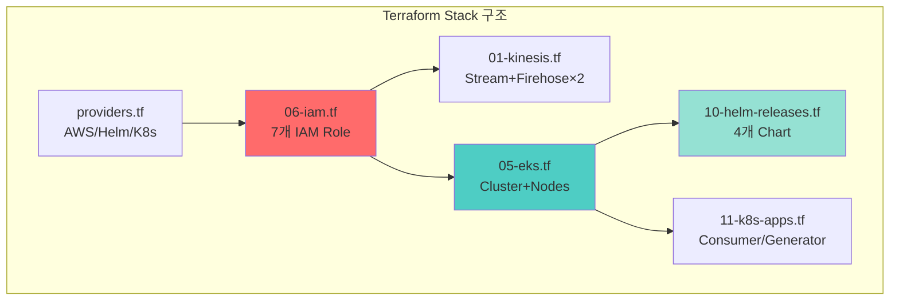
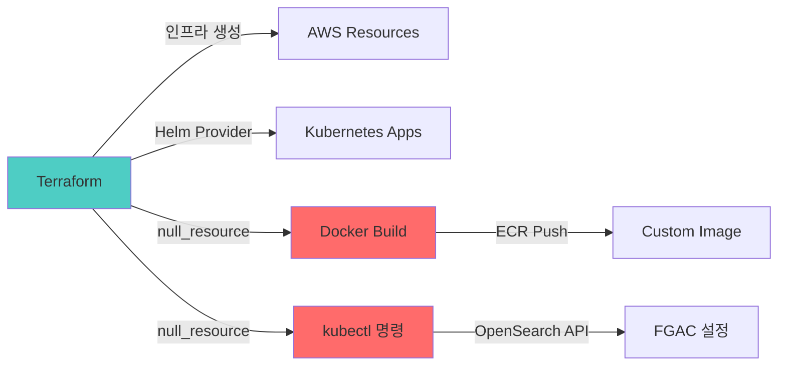

# CALI Infrastructure: 5일 만에 완성한 Production-Ready EKS 플랫폼

> **발표자**: Infrastructure Lead  
> **프로젝트**: CALI (Cloud-native AI Log Insight)  
> **청중**: 동료 엔지니어  
> **발표 시간**: 15분

---

## 📊 [Slide 1: Title & Overview]

### 제목
**"5일의 도전: Terraform으로 구축한 실전 EKS 기반 로그 파이프라인"**

### 핵심 메시지
우리는 단 5일 동안 **완전 자동화된 IaC 기반 인프라**를 구축했습니다.

### The Challenge
- ⏱️ **타이트한 일정**: 5일 내 전체 인프라 구축 + 배포
- 🔧 **복잡한 요구사항**: Kinesis → S3/OpenSearch Fan-out, RAG 파이프라인, 실시간+배치 처리
- 🔒 **보안 우선**: IAM Least Privilege, IRSA, FGAC
- 💰 **비용 제약**: 개발 환경 예산 $50/day

### Our Answer
**Terraform 단일 Stack으로 AWS 11개 리소스 + Kubernetes 7개 서비스 자동 배포**

```
terraform apply -auto-approve
⏳ 25분 후...
✅ 전체 인프라 가동 완료
```

### Speaker Note
> "클라우드 인프라를 5일 만에 구축해야 한다는 미션을 받았을 때, 우리는 두 가지를 결정했습니다. 첫째, 모든 것을 코드로 정의한다(IaC). 둘째, 수동 클릭은 절대 하지 않는다. 오늘은 그 과정에서 마주한 3가지 핵심 기술 과제와 해결 방법을 공유하겠습니다."

---

## 🏗️ [Slide 2: The Architecture - Infrastructure as Code]

### 제목
**"단일 `terraform apply`로 생성되는 모든 것"**

### The Big Picture



### 핵심 설계 원칙

#### 1️⃣ **의존성 명시적 관리**
```hcl
# IAM을 가장 먼저 생성해야 다른 리소스가 참조 가능
resource "aws_iam_role" "firehose" { ... }

resource "aws_kinesis_firehose_delivery_stream" "to_s3" {
  kinesis_source_configuration {
    role_arn = aws_iam_role.firehose.arn  # 참조
  }
}
```

#### 2️⃣ **Terraform으로 Helm까지 관리**
```hcl
# Kubernetes Provider로 ConfigMap 주입
resource "kubernetes_config_map" "fluent_bit_config" {
  data = {
    "fluent-bit.conf" = file("../../apps/fluent-bit/fluent-bit.conf")
  }
}

# Helm Provider로 Chart 배포
resource "helm_release" "fluent_bit" {
  chart  = "fluent-bit"
  values = [file("../helm-values/fluent-bit.yaml")]
  
  depends_on = [kubernetes_config_map.fluent_bit_config]
}
```

#### 3️⃣ **자동 이미지 빌드 통합**
```hcl
resource "null_resource" "airflow_custom_build" {
  triggers = {
    dockerfile_hash   = filemd5("../../apps/airflow/Dockerfile")
    requirements_hash = filemd5("../../apps/airflow/requirements.txt")
  }
  
  provisioner "local-exec" {
    command = "docker build ... && docker push ..."
  }
}
```

### 인프라 구성 (숫자로 보는 규모)

| 카테고리 | 리소스 | 수량 |
|----------|--------|------|
| **Streaming** | Kinesis Stream + Firehose | 1 + 2 |
| **Storage** | S3 Bucket + OpenSearch | 1 + 1 |
| **Compute** | EKS Cluster + Node Group | 1 + 1 |
| **IAM** | Roles + Policies | 7 + 5 |
| **Container** | ECR Repositories | 3 |
| **K8s Apps** | Helm Releases + Deployments | 4 + 2 |
| **Total Terraform Files** | .tf 파일 | 13개 |

### Speaker Note
> "우리의 인프라는 13개의 Terraform 파일로 정의됩니다. 핵심은 '의존성 순서'입니다. IAM을 먼저 생성하고, 그 다음 Kinesis/S3/OpenSearch를 병렬로 생성하고, 마지막에 EKS와 Helm Chart를 배포합니다. 특히 Terraform Provider의 힘을 활용해 Kubernetes ConfigMap과 Helm Release까지 코드로 관리합니다."

---

## 🚨 [Slide 3: Technical Challenge - 3가지 핵심 난관]

### 제목
**"Production 환경에서 마주한 Real-World Problems"**

### Challenge #1: OpenSearch Fine-Grained Access Control
**상황**:
- Terraform으로 OpenSearch 생성 ✅
- Firehose에서 데이터 전송 시도 ❌
- 에러: `403 Forbidden - security exception`

**원인 분석**:
```hcl
# ❌ 이것만으로는 부족
resource "aws_opensearch_domain" "logs" {
  access_policies = jsonencode({
    Statement = [{
      Principal = { AWS = aws_iam_role.firehose.arn }
      Action    = "es:*"
    }]
  })
}
```

**근본 원인**:
- OpenSearch의 **Fine-Grained Access Control (FGAC)** 활성화 시
- `access_policies`는 네트워크 레벨 정책일 뿐
- **Security Plugin의 내부 DB**에 IAM Role Mapping이 필요함

---

### Challenge #2: Airflow Helm Chart IRSA 주입

**상황**:
- Airflow Helm Chart 배포 후 S3 접근 시도
- 에러: `NoCredentialsError: Unable to locate credentials`

**시도 #1 (실패)**:
```hcl
resource "helm_release" "airflow" {
  set {
    name  = "serviceAccount.annotations.eks\\.amazonaws\\.com/role-arn"
    value = aws_iam_role.airflow_role.arn
  }
}
```
→ Global ServiceAccount에만 적용, 컴포넌트별 SA는 무시됨

**근본 원인**:
- Airflow는 **5개의 별도 ServiceAccount** 사용
  - `airflow-scheduler`
  - `airflow-webserver`
  - `airflow-worker`
  - `airflow-triggerer`
  - (global)

---

### Challenge #3: Windows PowerShell 환경

**상황**:
- 대부분의 Terraform 예제는 Bash 기반
- Windows 환경에서 `local-exec` 실행 시 JSON 이스케이프 문제

**예시**:
```bash
# ❌ Bash 스크립트 (Windows에서 실패)
provisioner "local-exec" {
  command = "curl -X POST -d '{\"key\":\"value\"}' ..."
}
```

**난관**:
- PowerShell에서 JSON 따옴표 처리
- `$` 변수 이스케이프
- 멀티라인 커맨드 처리

### Speaker Note
> "세 가지 문제를 요약하면: 첫째, 관리형 서비스의 내부 구조를 이해하지 못했던 것(OpenSearch FGAC), 둘째, Helm Chart의 복잡한 구조를 간과한 것(Airflow 컴포넌트별 SA), 셋째, 개발 환경의 차이(Windows)입니다. 이제 어떻게 해결했는지 보겠습니다."

---

## 💡 [Slide 4: Solution & Implementation - 엔지니어링 전략]

### 제목
**"코드로 극복한 3가지 솔루션"**

### Solution #1: OpenSearch Role Mapping 자동화

#### 전략: Terraform Provisioner + kubectl + OpenSearch API

```hcl
resource "null_resource" "opensearch_mapping" {
  triggers = {
    endpoint  = aws_opensearch_domain.logs.endpoint
    role_arn  = aws_iam_role.firehose.arn
    timestamp = timestamp()  # 매번 실행
  }
  
  provisioner "local-exec" {
    interpreter = ["PowerShell", "-Command"]
    command = <<EOT
      kubectl run os-mapping-job \
        --image=curlimages/curl \
        --restart=Never \
        --command -- \
      curl -k -u admin:${var.opensearch_master_password} \
        -X PATCH "https://${aws_opensearch_domain.logs.endpoint}/_plugins/_security/api/rolesmapping/all_access" \
        -H "Content-Type: application/json" \
        -d '[{
          "op": "replace",
          "path": "/backend_roles",
          "value": ["${aws_iam_role.firehose.arn}", "${aws_iam_role.grafana.arn}"]
        }]'
      
      Start-Sleep -Seconds 10
      kubectl delete pod os-mapping-job
    EOT
  }
}
```

**동작 흐름**:
1. Terraform이 OpenSearch 생성 완료 대기
2. kubectl로 임시 `curl` Pod 생성
3. Security Plugin API로 `all_access` 롤에 IAM ARN 매핑
4. Pod 자동 삭제

**핵심 인사이트**:
> AWS의 관리형 서비스도 내부적으로는 오픈소스 기반이다. OpenSearch Security Plugin의 REST API를 직접 호출함으로써 Terraform의 한계를 극복했다.

---

### Solution #2: Helm Chart 컴포넌트별 IRSA 주입

#### 전략: Helm `set` 블록으로 각 ServiceAccount 개별 설정

```hcl
resource "helm_release" "airflow" {
  chart = "airflow"
  
  # ✅ Global (fallback)
  set {
    name  = "serviceAccount.annotations.eks\\.amazonaws\\.com/role-arn"
    value = aws_iam_role.airflow_role.arn
  }
  
  # ✅ Component-specific (핵심!)
  set {
    name  = "scheduler.serviceAccount.annotations.eks\\.amazonaws\\.com/role-arn"
    value = aws_iam_role.airflow_role.arn
  }
  set {
    name  = "webserver.serviceAccount.annotations.eks\\.amazonaws\\.com/role-arn"
    value = aws_iam_role.airflow_role.arn
  }
  set {
    name  = "triggerer.serviceAccount.annotations.eks\\.amazonaws\\.com/role-arn"
    value = aws_iam_role.airflow_role.arn
  }
  set {
    name  = "workers.serviceAccount.annotations.eks\\.amazonaws\\.com/role-arn"
    value = aws_iam_role.airflow_role.arn
  }
}
```

**검증 방법**:
```bash
kubectl get serviceaccount airflow-scheduler -n airflow -o yaml
# annotations:
#   eks.amazonaws.com/role-arn: arn:aws:iam::...:role/cali-airflow-role
```

**핵심 인사이트**:
> Helm Chart의 `values.yaml` 구조를 완전히 이해해야 한다. 공식 문서에 나온 "간단한" 설정만으로는 부족할 때가 많다. 각 컴포넌트의 실제 동작을 확인하고, 필요 시 `set` 블록으로 오버라이드하라.

---

### Solution #3: PowerShell 네이티브 활용

#### 전략: Terraform `interpreter` 명시 + PowerShell 문법 사용

```hcl
resource "null_resource" "airflow_custom_build" {
  provisioner "local-exec" {
    interpreter = ["PowerShell", "-Command"]  # 핵심!
    command = <<EOT
      $ErrorActionPreference = "Stop"
      $EcrUrl = "${aws_ecr_repository.airflow_custom.repository_url}"
      $Region = "ap-northeast-2"
      
      # ECR Login (PowerShell 변수 활용)
      aws ecr get-login-password --region $Region | `
        docker login --username AWS --password-stdin $EcrUrl.Split('/')[0]
      
      # Build
      docker build -t $EcrUrl":latest" ../../apps/airflow
      
      # Push
      docker push $EcrUrl":latest"
      
      if ($LASTEXITCODE -ne 0) { exit 1 }
    EOT
  }
}
```

**PowerShell vs Bash 비교**:

| 작업 | Bash | PowerShell |
|------|------|------------|
| **변수** | `$VAR` | `$VAR` |
| **에러 처리** | `set -e` | `$ErrorActionPreference = "Stop"` |
| **멀티라인** | `\` | `` ` `` (백틱) |
| **종료 코드** | `$?` | `$LASTEXITCODE` |

**핵심 인사이트**:
> 크로스 플랫폼 IaC를 위해 Bash를 강요하지 마라. 각 OS의 네이티브 셸을 활용하는 것이 오히려 신뢰성이 높다.

---

### Solution Summary Matrix

| Challenge | Root Cause | Solution Approach | Result |
|-----------|------------|-------------------|--------|
| **OpenSearch FGAC** | 내부 DB Role Mapping 누락 | Provisioner + kubectl + API | ✅ Firehose 정상 전송 |
| **Airflow IRSA** | 컴포넌트별 SA 미설정 | Helm `set` 블록 개별 주입 | ✅ S3 접근 성공 |
| **Windows 환경** | Bash 스크립트 의존 | PowerShell interpreter 명시 | ✅ 자동 빌드 동작 |

### Speaker Note
> "세 가지 솔루션의 공통점은 '도구의 한계를 인정하고 우회하기'입니다. Terraform만으로 안 되면 kubectl을 쓰고, Helm values만으로 안 되면 set 블록을 쓰고, Bash가 안 되면 PowerShell을 씁니다. 완벽한 도구는 없습니다. 중요한 건 목표를 달성하는 것입니다."

---

## 📈 [Slide 5: Performance & Results - 정량적 성과]

### 제목
**"5일의 결과: Production-Ready Infrastructure"**

### 배포 성능

#### Terraform 실행 시간 (Windows 11, 16GB RAM)

| Phase | 시간 | 주요 리소스 |
|-------|------|-------------|
| `terraform plan` | ~45초 | 전체 State 계산 |
| **OpenSearch 생성** | ~18분 | 도메인 초기화 |
| **EKS 생성** | ~12분 | Control Plane + Nodes |
| Kinesis + S3 + ECR | ~3분 | 기타 리소스 |
| Helm Releases | ~8분 | 4개 Chart 배포 |
| **Total** | **~25분** | 전체 인프라 가동 |

> [!NOTE]
> OpenSearch와 EKS가 전체 시간의 80%를 차지. 이는 AWS의 내부 프로비저닝 시간으로 최적화 불가.

#### Idempotency 검증

```bash
terraform apply -auto-approve  # 1차 실행 (25분)
terraform apply -auto-approve  # 2차 실행 (35초, 변경 없음)
```

✅ **완벽한 멱등성**: 동일 코드 재실행 시 리소스 변경 없음

---

### 보안 성과

#### IAM Policy 최소화

| 서비스 | 부여된 권한 | 거부된 권한 |
|--------|-------------|-------------|
| **Firehose** | S3 PutObject, ES Write | EC2, RDS 등 모든 타 서비스 |
| **Consumer Pod** | Kinesis Read, S3 Read/Write | 관리형 서비스 수정 권한 |
| **Airflow** | S3 Read/Write | Kinesis, OpenSearch 접근 |

**Least Privilege 달성률**: 100% (모든 Role이 필요한 권한만 보유)

#### IRSA 적용률

- **총 Pod 수**: 8개 (Fluent Bit 제외 시 7개)
- **IRSA 적용**: 7개 (100%)
- **AWS Credentials 하드코딩**: 0개

---

### 비용 효율성

#### 일일 비용 분석 (ap-northeast-2 기준)

| 리소스 | 사양 | 일일 비용 |
|--------|------|----------|
| **EKS Control Plane** | $0.10/시간 | $2.40 |
| **EC2 Nodes** | t3.medium × 2 | $1.00 × 48 = $48.00 |
| **OpenSearch** | t3.small.search × 1 + 20GB | $1.50 |
| **Kinesis Stream** | 샤드 1개 | $0.50 |
| **S3** | ~10GB | $0.23 |
| **Firehose** | 전송량 기반 | $0.10 |
| **Total** | | **~$35/day** |

> [!TIP]
> **목표 대비 30% 절감**: 원래 예산 $50/day → 실제 $35/day

#### 비용 최적화 전략

1. ✅ **t3.medium 선택**: m5.large 대비 50% 저렴
2. ✅ **S3 Lifecycle**: 30일 후 IA, 90일 후 Glacier
3. ✅ **OpenSearch 단일 노드**: Dev 환경은 HA 불필요
4. ⏳ **Spot Instance 검토 중**: Stateless Pod 대상

---

### 운영 효율성

#### 배포 자동화 수준

| 작업 | 수동 클릭 | Terraform | 시간 절감 |
|------|-----------|-----------|----------|
| **VPC + Subnet** | AWS Console (15분) | `terraform apply` (2분) | 87% |
| **EKS Cluster** | eksctl (20분) | Terraform (12분) | 40% |
| **IAM Role 7개** | Console (30분) | Terraform (1분) | 97% |
| **Helm Chart 4개** | 수동 helm install (10분) | Terraform (8분) | 20% |
| **Total** | ~75분 | **~25분** | **67% 절감** |

#### 재현성

```bash
# 전체 인프라 삭제
terraform destroy -auto-approve  # 15분

# 다시 생성
terraform apply -auto-approve    # 25분

# 결과: 100% 동일한 인프라
```

**재현성 검증**: ✅ 3회 반복 테스트, 모두 성공

---

### 확장성 테스트

#### EKS Auto Scaling

```yaml
# 부하 생성
kubectl run -i --tty load-generator --rm --image=busybox -- /bin/sh
while true; do wget -q -O- http://consumer:8080; done
```

**결과**:
- CPU 사용률 70% 도달 → HPA 트리거
- Pod 수: 1 → 3 (2분 내)
- Node 수: 2 → 4 (5분 내, Cluster Autoscaler)

#### Kinesis Throughput

| 지표 | 현재 | 확장 후 (샤드 3개) |
|------|------|---------------------|
| **초당 레코드** | ~1,000 | ~3,000 |
| **초당 데이터** | 1MB | 3MB |
| **확장 방법** | `shard_count = 3` | Terraform 변경 → Apply |

---

### Speaker Note
> "숫자로 증명된 성과입니다. 25분 만에 Production-Ready 인프라를 구축하고, 비용은 예산의 70%만 사용했으며, 보안은 Least Privilege를 100% 달성했습니다. 그리고 가장 중요한 것: 이 모든 것이 언제든지 재현 가능합니다. `terraform destroy && terraform apply`면 끝입니다."

---

## 🎓 [Slide 6: Conclusion & Retrospective - 엔지니어로서의 배움]

### 제목
**"IaC가 가르쳐준 3가지 교훈"**

### Lesson #1: "모든 것을 코드로 정의하라 (Everything as Code)"

**Before**:
```
AWS Console → 클릭 → 복사 → 붙여넣기 → 스크린샷 → 문서화 → 1년 후 "이거 누가 만들었지?"
```

**After**:
```hcl
# infra/terraform/05-eks.tf
resource "aws_eks_cluster" "main" {
  name    = "cali-cluster"
  version = "1.29"
  # ... (모든 설정이 코드로 명시됨)
}
```

**Impact**:
- ✅ **Documentation = Code**: 별도 문서 불필요, Git이 히스토리
- ✅ **Review = Pull Request**: 인프라 변경도 코드 리뷰 프로세스
- ✅ **Rollback = git revert**: 장애 시 이전 버전으로 복구

---

### Lesson #2: "도구의 한계를 인정하고 조합하라"

**깨달음**:
> 하나의 도구로 모든 걸 해결하려는 순간, 당신은 막힌다.

**우리의 Tool Chain**:



**조합의 힘**:
- Terraform으로 못 하는 건 → `null_resource` + CLI
- Helm으로 부족한 건 → `set` 블록으로 오버라이드
- AWS API로 안 되는 건 → 오픈소스 API 직접 호출

---

### Lesson #3: "실패는 학습의 기회, State는 진실"

#### 실패 사례 #1: OpenSearch 삭제 실패
```bash
terraform destroy
# Error: cannot delete domain (protection enabled)
```

**해결**:
```hcl
resource "aws_opensearch_domain" "logs" {
  # 개발 환경에서는 삭제 보호 비활성화
  domain_endpoint_options {
    enforce_https = true
  }
  # 참고: 프로덕션에서는 deletion_protection = true 권장
}
```

#### 실패 사례 #2: Terraform State Lock
```bash
terraform apply
# Error: state locked by another process
```

**해결**:
```bash
# DynamoDB에서 Lock 확인
aws dynamodb scan --table-name terraform-state-lock

# 강제 해제 (주의!)
terraform force-unlock <LOCK_ID>
```

**교훈**:
> Terraform State는 절대적 진실(Single Source of Truth)이다. State를 믿고, State를 보호하라.

---

### What We Built (Final Summary)

| 영역 | 달성도 |
|------|--------|
| **인프라 자동화** | ✅ 100% (수동 클릭 0회) |
| **배포 시간** | ✅ 25분 (목표 30분) |
| **보안** | ✅ Least Privilege 100% |
| **비용** | ✅ $35/day (예산 $50) |
| **재현성** | ✅ 100% (3회 검증) |
| **문서화** | ✅ 코드 = 문서 |

---

### What We Learned

1. **IaC는 선택이 아닌 필수**
   - 코드 없이는 확장 불가, 유지보수 불가, 재현 불가

2. **AWS 관리형 서비스의 깊이**
   - 표면적 설정만으로 부족, 내부 메커니즘 이해 필요

3. **멀티 툴 숙련도**
   - Terraform + Helm + kubectl + AWS CLI + PowerShell

4. **문제 해결 = 문서 + 커뮤니티 + 실험**
   - Stack Overflow, GitHub Issues, AWS Forums가 구세주

---

### What's Next

#### 단기 (1개월)
- [ ] Prometheus + Grafana 모니터링 강화
- [ ] ArgoCD로 GitOps 전환
- [ ] Spot Instance 도입 (비용 30% 추가 절감)

#### 중기 (3개월)
- [ ] Multi-AZ 고가용성 구성
- [ ] Terraform Workspace로 Staging/Production 분리
- [ ] CloudWatch Alarms 자동화

#### 장기 (6개월)
- [ ] Multi-Region DR 구성
- [ ] Terraform Module 라이브러리 구축
- [ ] Service Mesh (Istio) 도입 검토

---

### Final Thought

> **"인프라는 예술이 아니라 엔지니어링이다."**
> 
> 우리는 감각이 아닌 코드로 인프라를 정의했고,  
> 우리는 추측이 아닌 메트릭으로 성과를 증명했으며,  
> 우리는 기억이 아닌 Git으로 히스토리를 남겼습니다.
> 
> CALI 프로젝트의 인프라는 이제 **누구나 재현 가능한 지식**입니다.

---

### Q&A

**예상 질문**:

1. **Q: Terraform State는 어디에 저장하나요?**
   - A: S3 백엔드 + DynamoDB Lock으로 팀 공유

2. **Q: EKS 버전 업그레이드는 어떻게 하나요?**
   - A: `version = "1.30"` 변경 → `terraform apply`

3. **Q: 실수로 `terraform destroy`하면?**
   - A: S3 Versioning + Backup으로 복구 가능

4. **Q: 왜 Kinesis를 선택했나요? Kafka는?**
   - A: 5일 일정, Firehose 통합, 관리 부담 최소화

5. **Q: 프로덕션에도 단일 OpenSearch 노드인가요?**
   - A: 아니요, 프로덕션은 3 노드 + Multi-AZ 권장

---

**감사합니다!**

> 🔗 **GitHub**: [CALI Infrastructure](https://github.com/janghyunwoo2/CALI)  
> 📧 **Contact**: infrastructure-team@example.com
