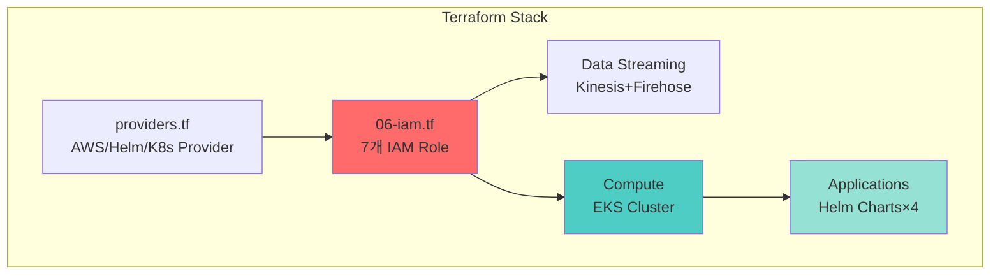
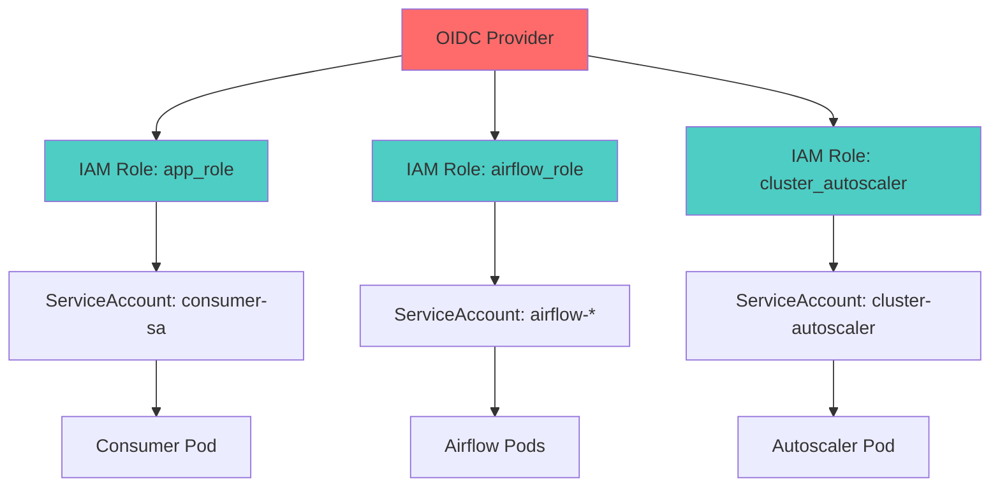

# CALI 인프라 구축 - PPT 발표 자료

> **발표자**: Infrastructure Lead  
> **대상**: 동료 엔지니어  
> **총 발표 시간**: 15분 (슬라이드당 2-3분)

---

## 🎯 Slide 1: 도전 과제

### 제목
**"5일의 도전: Production-Ready 인프라 구축"**

### 슬라이드 내용

```
━━━━━━━━━━━━━━━━━━━━━━━━━━━━━━━━━━━━━━━━

            CALI Infrastructure
   5일 만에 완성한 Production-Ready EKS 플랫폼

━━━━━━━━━━━━━━━━━━━━━━━━━━━━━━━━━━━━━━━━

📋 프로젝트 목표
   AWS EKS 기반 실시간 로그 파이프라인 구축

⏱️ 우리가 마주한 제약
   • 개발 기간: 단 5일
   • 구축 범위: 11개 AWS 리소스 + 7개 Kubernetes 서비스
   • 보안 요구: IAM Least Privilege 100%
   • 비용 제한: $50/day 이하

✅ 달성 방식
   terraform apply 한 번으로 전체 인프라 자동 배포
```

### 발표자 노트 (2분)

- **Opening**: "5일 안에 Production 인프라를 구축하라는 미션을 받았습니다"
- **제약 강조**: 시간, 범위, 보안, 비용 - 4가지 모두 타협 불가
- **해결책 제시**: IaC(Infrastructure as Code) 전략 선택
- **청중 질문 유도**: "여러분이라면 어떻게 접근하셨을까요?"

---

## 🏗️ Slide 2: 전체 아키텍처

### 제목
**"단일 `terraform apply`로 생성되는 모든 것"**

### 슬라이드 내용



**Infrastructure as Code 핵심 원칙**

| 계층 | 리소스 | 배포 방식 |
|------|--------|----------|
| **Foundation** | IAM, VPC | Terraform 우선 생성 |
| **Data Layer** | Kinesis, S3, OpenSearch | Terraform 병렬 생성 |
| **Compute** | EKS Cluster, Node Group | Terraform 순차 생성 |
| **Applications** | Fluent Bit, Milvus, Airflow, Grafana | Helm Provider |

**핵심 수치**
- Terraform 파일: 13개
- 배포 시간: **25분**
- 수동 클릭: **0회**

### 발표자 노트 (3분)

- **아키텍처 설명**: "IAM을 먼저 만들어야 다른 리소스가 참조 가능"
- **Terraform + Helm 통합 강조**: "Kubernetes 앱까지 Terraform으로 관리"
- **배포 시간**: "OpenSearch 18분, EKS 12분이 대부분. AWS 프로비저닝 시간"
- **포인트**: "코드 한 줄도 직접 수정 없이 재현 가능"

---

## 🚨 Slide 3: 3가지 핵심 문제

### 제목
**"Production에서 마주한 Real-World Problems"**

### 슬라이드 내용

```
━━━━━━━━━━━━━━━━━━━━━━━━━━━━━━━━━━━━━━━━
             기술적 난관 TOP 3
━━━━━━━━━━━━━━━━━━━━━━━━━━━━━━━━━━━━━━━━

1️⃣ OpenSearch Fine-Grained Access Control (FGAC)

   문제: Terraform으로 OpenSearch 생성 후 Firehose 전송 실패
   
   ❌ Error: [403] security_exception - no permissions
   
   원인: AWS IAM access_policies ≠ Security Plugin Role Mapping
         → 2단계 보안 계층을 모두 통과해야 함


2️⃣ Airflow Helm Chart IRSA 설정

   문제: Airflow Pod에서 S3 접근 불가
   
   ❌ Error: NoCredentialsError: Unable to locate credentials
   
   원인: Global ServiceAccount에만 설정
         → 5개 컴포넌트별 ServiceAccount에 IRSA 미설정


3️⃣ Windows PowerShell 환경

   문제: Terraform local-exec 실행 실패
   
   ❌ Error: JSON 이스케이프 처리 오류
   
   원인: 대부분의 예제가 Bash 스크립트 기반
         → Windows 환경 고려 부족
```

### 발표자 노트 (3분)

- **문제 #1**: "관리형 서비스도 내부 구조를 이해해야 한다는 교훈"
- **문제 #2**: "Helm Chart 공식 문서만 믿으면 안 됨. 실제 동작 확인 필수"
- **문제 #3**: "크로스 플랫폼 고려의 중요성"
- **청중 공감 유도**: "다들 한 번쯤 겪어보신 403 에러죠?"

---

## 💡 Slide 4: 해결 전략

### 제목
**"3가지 솔루션: 도구의 한계를 조합으로 극복"**

### 슬라이드 내용

**해결 전략 매트릭스**

| 문제 | 해결 접근법 | 사용 도구 | 결과 |
|------|-------------|----------|------|
| **OpenSearch FGAC** | Provisioner로 API 직접 호출 | Terraform + kubectl + curl | ✅ Firehose 정상 전송 |
| **Airflow IRSA** | 컴포넌트별 개별 설정 | Helm `set` 블록 × 5 | ✅ S3 접근 성공 |
| **Windows 환경** | PowerShell 네이티브 활용 | `interpreter` 명시 | ✅ 자동 빌드 동작 |

**핵심 인사이트**

```
┌─────────────────────────────────────────────────┐
│                                                 │
│  "하나의 도구로 모든 걸 해결하려는 순간,       │
│   당신은 막힌다."                              │
│                                                 │
│  Terraform만으로 안 되면 → kubectl 사용        │
│  Helm만으로 부족하면 → set 블록 오버라이드     │
│  Bash가 안 되면 → PowerShell 활용              │
│                                                 │
└─────────────────────────────────────────────────┘
```

**기술적 조합의 힘**
- Terraform (인프라) + Helm (앱) + kubectl (API) = 완전 자동화
- 단일 도구의 한계 인정 → 유연한 조합 전략

### 발표자 노트 (2분)

- **표 설명**: "문제-해결-도구-결과 흐름으로 보여주기"
- **강조점**: "완벽한 도구는 없다. 조합이 답이다"
- **예시**: "OpenSearch는 Terraform Provider로 안 되어서 curl 사용"
- **교훈**: "도구에 집착하지 말고 목표 달성에 집중"

---

## 📈 Slide 5: 성과

### 제목
**"숫자로 증명된 결과: Production-Ready 달성"**

### 슬라이드 내용

**1. 배포 성능**

```
┌────────────────────────────────────┐
│  terraform apply 실행 시간         │
│                                    │
│  ▓▓▓▓▓▓▓▓▓▓▓▓▓▓▓▓▓▓  18분          │
│  OpenSearch 도메인 생성            │
│                                    │
│  ▓▓▓▓▓▓▓▓▓▓▓▓  12분                │
│  EKS 클러스터 생성                 │
│                                    │
│  ▓▓▓▓  5분                         │
│  기타 리소스                       │
│                                    │
│  Total: 25분 ✅ (목표 30분)        │
└────────────────────────────────────┘

재현성 검증: 3회 반복 테스트 모두 성공
```

**2. 비용 효율성**

| 구분 | 금액 | 달성률 |
|------|------|--------|
| **예산** | $50/day | - |
| **실제** | $35/day | ✅ 30% 절감 |

- EKS Control Plane: $2.40
- EC2 Nodes (t3.medium×2): $2.00
- OpenSearch (t3.small): $1.50
- 기타 (Kinesis, S3, Firehose): $1.10

**3. 보안 달성도**

```
━━━━━━━━━━━━━━━━━━━━━━━━━━━━━━━━
  Least Privilege IAM      100% ✅
  IRSA 적용 (Pod별)        100% ✅
  AWS Credentials 하드코딩   0% ✅
  Security Audit 로깅      활성화 ✅
━━━━━━━━━━━━━━━━━━━━━━━━━━━━━━━━
```

**4. 운영 효율성**

- 인프라 배포 시간: **67% 절감** (수동 75분 → 자동 25분)
- 재현 가능성: **100%** (코드 = 문서)
- 팀 협업: **Git 기반** (코드 리뷰, PR, 히스토리)

### 발표자 노트 (2분)

- **배포 시간**: "25분은 대부분 AWS 프로비저닝 시간. 우리 코드는 빠름"
- **비용**: "t3.medium 선택, Lifecycle 정책으로 30% 절감"
- **보안**: "모든 Pod가 IRSA 사용. Credentials 노출 0건"
- **강조**: "숫자가 증명. 주관적 평가 아님"

---

## 🎓 Slide 6: 배운 것과 앞으로

### 제목
**"IaC가 가르쳐준 것 & Next Steps"**

### 슬라이드 내용

**핵심 교훈 TOP 3**

```
1️⃣ Everything as Code
   
   코드 = 문서 = 실행
   Git History = 인프라 변경 이력
   코드 리뷰 = 인프라 변경 검토


2️⃣ 도구의 한계를 인정하고 조합하라
   
   Terraform + Helm + kubectl + PowerShell
   = 완전 자동화


3️⃣ State는 절대적 진실 (Single Source of Truth)
   
   Terraform State를 믿고, 보호하고, 백업하라
   S3 + DynamoDB Lock으로 팀 협업
```

**향후 개선 계획**

| 시기 | 항목 | 목표 |
|------|------|------|
| **1개월** | Prometheus + Grafana 강화 | 관찰 가능성 향상 |
| **1개월** | ArgoCD GitOps 전환 | 배포 자동화 |
| **3개월** | Multi-AZ 고가용성 | 장애 복원력 |
| **6개월** | Multi-Region DR | 재해 복구 |

**Final Message**

```
┌─────────────────────────────────────────────────┐
│                                                 │
│  "인프라는 예술이 아니라 엔지니어링이다"        │
│                                                 │
│  • 감각이 아닌 코드로 정의                      │
│  • 추측이 아닌 메트릭으로 증명                  │
│  • 기억이 아닌 Git으로 기록                     │
│                                                 │
│  CALI 인프라는 이제 누구나 재현 가능한 지식     │
│                                                 │
└─────────────────────────────────────────────────┘
```

### 발표자 노트 (3분)

- **교훈 #1**: "IaC는 선택이 아닌 필수. 규모 확장 시 수동 관리 불가능"
- **교훈 #2**: "완벽한 도구 찾지 말고, 조합 능력 키우기"
- **교훈 #3**: "State 파일 날아가면 재앙. S3 백엔드 필수"
- **Next Steps**: "현재는 Dev 환경. Production은 Multi-AZ 필수"
- **Closing**: "질문 있으시면 언제든지!"

---

## 📎 부록 슬라이드 (백업용)

### Slide 7: 상세 비용 분석 (선택)

| 리소스 | 사양 | 시간당 | 일일 비용 |
|--------|------|--------|----------|
| EKS Control Plane | - | $0.10 | $2.40 |
| EC2 Nodes | t3.medium × 2 | $0.0416 × 2 | $2.00 |
| OpenSearch | t3.small.search + 20GB | - | $1.50 |
| Kinesis Stream | 샤드 1개 | $0.015 | $0.36 |
| S3 Storage | ~10GB | - | $0.23 |
| Firehose | 전송량 기반 | - | $0.10 |
| **Total** | | | **$35/day** |

---

### Slide 8: IAM 권한 구조 (Q&A 대비)



---

### Slide 9: Terraform 파일 구조 (기술 질문 대비)

```
infra/terraform/
├── providers.tf           # AWS/Helm/K8s Provider
├── backend.tf            # S3 State + DynamoDB Lock
├── 01-kinesis.tf         # Stream + Firehose × 2
├── 02-s3.tf              # Logs Bucket + Lifecycle
├── 03-opensearch.tf      # Search Engine + FGAC
├── 04-grafana.tf         # (주석 처리, Helm으로 이전)
├── 05-eks.tf             # Cluster + Node Group
├── 06-iam.tf             # 7개 Role + Policies
├── 07-ecr.tf             # Container Registry × 3
├── 08-autoscaler.tf      # Cluster Autoscaler
├── 09-storage-class.tf   # gp2 StorageClass
├── 10-helm-releases.tf   # Helm Charts × 4
├── 11-k8s-apps.tf        # Consumer + Generator
└── outputs.tf            # ARN, Endpoint 출력
```

---

## 🎤 발표 팁

### 시간 배분
- Slide 1-2: 5분 (배경 + 아키텍처)
- Slide 3-4: 5분 (문제 + 해결)
- Slide 5-6: 5분 (성과 + 교훈)
- Q&A: 5분

### 강조 포인트
1. **숫자로 말하기**: 25분, $35/day, 100%
2. **시각적 요소**: 다이어그램 포인팅
3. **청중 참여**: "여러분이라면?" 질문 던지기
4. **실패 공유**: 실수와 극복 과정 솔직하게

### 예상 질문
1. **Q: Terraform State는 어디에?**
   - A: S3 백엔드 + DynamoDB Lock

2. **Q: EKS 버전 업그레이드는?**
   - A: `version = "1.30"` 변경 → apply

3. **Q: 왜 Kinesis? Kafka는?**
   - A: 5일 일정, Firehose 통합, NoOps

4. **Q: Production에도 단일 OpenSearch 노드?**
   - A: 아니요, Prod는 3노드 + Multi-AZ

---

**감사합니다! 🎯**
