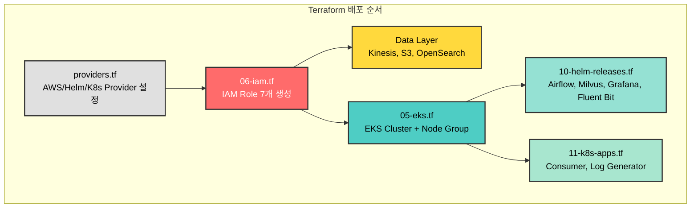
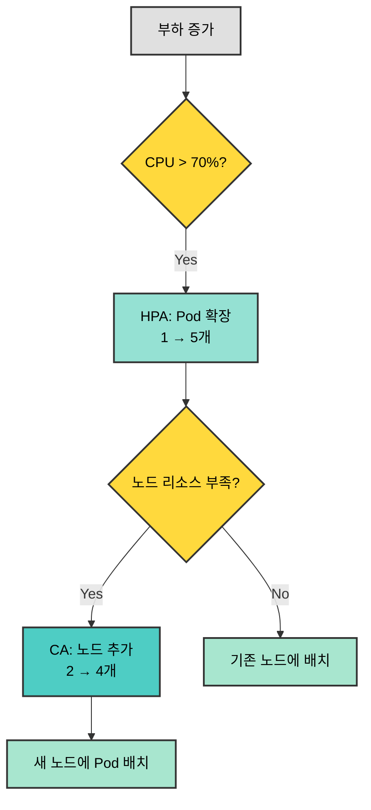
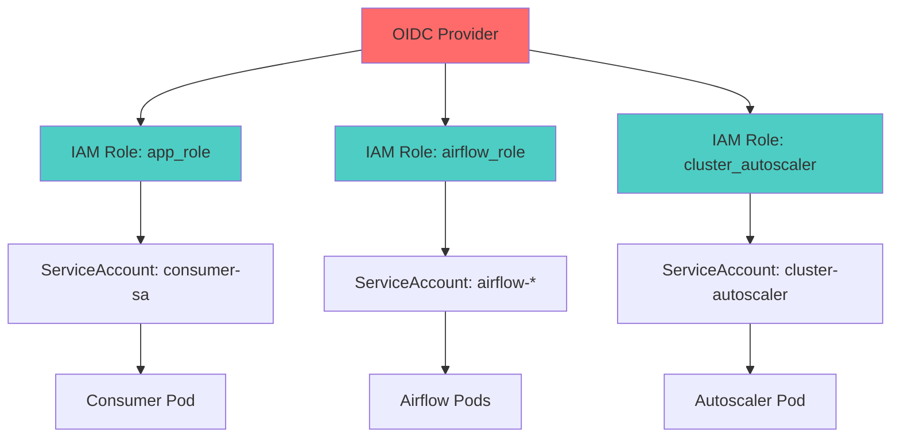

# CALI 인프라 구축 - PPT 발표 자료

> **발표자**: Infrastructure Lead  
> **대상**: 동료 엔지니어  
> **총 발표 시간**: 15분 (슬라이드당 2-3분)

---

## 🎯 Slide 1: 도전 과제

### 제목
**"5일의 도전: Production-Ready 인프라 구축"**

### 슬라이드 내용

```
━━━━━━━━━━━━━━━━━━━━━━━━━━━━━━━━━━━━━━━━

            CALI Infrastructure
   5일 만에 완성한 Production-Ready EKS 플랫폼

━━━━━━━━━━━━━━━━━━━━━━━━━━━━━━━━━━━━━━━━

📋 프로젝트 목표
   AWS EKS 기반 실시간 로그 파이프라인 구축

⏱️ 우리가 마주한 제약
   • 개발 기간: 단 5일
   • 구축 범위: 11개 AWS 리소스 + 7개 Kubernetes 서비스
   • 보안 요구: IAM Least Privilege 100%
   • 비용 제한: $50/day 이하

✅ 달성 방식
   terraform apply 한 번으로 전체 인프라 자동 배포
```

### 발표자 노트 (2분)

- **Opening**: "5일 안에 Production 인프라를 구축하라는 미션을 받았습니다"
- **제약 강조**: 시간, 범위, 보안, 비용 - 4가지 모두 타협 불가
- **해결책 제시**: IaC(Infrastructure as Code) 전략 선택
- **청중 질문 유도**: "여러분이라면 어떻게 접근하셨을까요?"

---

## 🏗️ Slide 2: 전체 아키텍처

### 제목
**"단일 `terraform apply`로 생성되는 모든 것"**

### 슬라이드 내용



**Infrastructure as Code 배포 순서**

| 단계 | Terraform 파일 | 생성 리소스 | 배포 방식 |
|------|---------------|------------|----------|
| **1단계** | `providers.tf` | AWS, Helm, Kubernetes Provider | 초기 설정 |
| **2단계** | `06-iam.tf` | 7개 IAM Role (EKS, Airflow, App 등) | 우선 생성 (다른 리소스가 참조) |
| **3단계** | `01-kinesis.tf`, `02-s3.tf`, `03-opensearch.tf` | Kinesis Stream, S3 Bucket, OpenSearch | 병렬 생성 |
| **4단계** | `05-eks.tf` | EKS Cluster, Node Group (t3.medium × 2~4) | 순차 생성 (12분 소요) |
| **5단계** | `07-ecr.tf` | Container Registry (Airflow, Consumer, Log Generator) | 이미지 빌드/푸시 |
| **6단계** | `10-helm-releases.tf` | Airflow, Milvus, Grafana, Fluent Bit | Helm Provider로 자동 배포 |
| **7단계** | `11-k8s-apps.tf` | Consumer, Log Generator Deployment | Kubernetes Provider |
| **8단계** | `08-autoscaler.tf`, `09-metrics-server.tf` | Cluster Autoscaler, Metrics Server | Auto-scaling 인프라 |

**핵심 수치**
- **Terraform 파일**: 13개
- **배포 시간**: **25분** (OpenSearch 18분 + EKS 12분이 대부분)
- **수동 클릭**: **0회** (완전 자동화)
- **재현 가능성**: **100%** (코드 = 문서)

### 발표자 노트 (3분)

- **배포 순서 강조**: "IAM을 먼저 만들어야 EKS, Airflow 등이 해당 Role을 참조할 수 있습니다"
- **Terraform + Helm 통합**: "Kubernetes 애플리케이션(Airflow, Milvus)까지 Terraform `helm_release` 리소스로 관리합니다"
- **배포 시간 설명**: "25분 중 대부분은 AWS 프로비저닝 시간입니다. OpenSearch가 18분으로 가장 오래 걸립니다"
- **핵심 포인트**: "코드만 있으면 누구나 동일한 인프라를 재현할 수 있습니다. 수동 설정 0건"
- **실제 예시**: "팀원이 새로 합류해도 `terraform apply` 한 번이면 끝"


---

## 🔐 Slide 2.5: IAM 권한 설계 (보안)

### 제목
**"IRSA와 Least Privilege: 보안 사고를 사전에 차단"**

### 슬라이드 내용

**왜 IRSA와 Least Privilege인가?**

| 기술 | 해결하는 문제 | 사용 안 하면? (위험) |
|------|--------------|---------------------|
| **IRSA** | Pod마다 다른 AWS 권한 필요<br/>(Consumer는 Kinesis 읽기<br/>Airflow는 S3 쓰기) | ❌ AWS Access Key 하드코딩<br/>❌ Git 노출 위험<br/>❌ 모든 Pod 동일 권한 사용 |
| **Least Privilege** | 해킹/실수 시 피해 최소화<br/>(Firehose는 S3 쓰기만) | ❌ 관리자 권한 남발<br/>❌ 실수로 전체 S3 삭제 가능<br/>❌ 해킹 시 모든 리소스 접근 |

**IAM Role 구성 (Least Privilege 적용)**

| Pod / Service | ServiceAccount | IAM Role | 권한 범위 |
|---------------|----------------|----------|----------|
| **Consumer** | `consumer-sa` | `cali-app-role` | Kinesis 읽기, S3 쓰기 <br/>(리소스: `cali-*`만) |
| **Airflow** | `airflow-*` (5개) | `cali-airflow-role` | S3 읽기/쓰기 <br/>(버킷: `cali-logs-*`만) |
| **Grafana** | `grafana` | `cali-grafana-role` | OpenSearch 읽기 전용 |
| **Cluster Autoscaler** | `cluster-autoscaler` | `cali-autoscaler-role` | Auto Scaling 제어 <br/>(태그: `cali-*`만) |
| **Firehose** | (AWS Service) | `cali-firehose-role` | S3 `PutObject`만 <br/>(읽기/삭제 불가) |

**핵심 수치**
- **IAM Role 개수**: 7개 (역할별 완전 분리)
- **하드코딩된 AWS Credentials**: **0개** (IRSA 100% 적용)
- **관리자 권한 사용**: **0건** (Least Privilege 100%)
- **리소스 제한**: 모든 정책에 `cali-*` ARN 명시

### 발표자 노트 (3분)

- **IRSA 강조**: "Pod에 AWS Key를 환경 변수로 넣지 않습니다. OIDC를 통해 임시 자격 증명을 자동 발급받습니다"
- **실제 예시**: "만약 Consumer Pod이 해킹당해도, Kinesis와 S3만 접근 가능하고 EC2나 RDS는 건드릴 수 없습니다"
- **Least Privilege 사례**: 
  - "Firehose는 S3에 쓰기만 가능합니다. 실수로 삭제할 수 없습니다"
  - "모든 권한에 리소스 ARN이 `cali-*`로 제한되어 있어, 다른 프로젝트 리소스는 접근 불가"
- **비교 강조**: "만약 AdministratorAccess를 쓴다면? 해커가 전체 AWS 계정을 장악할 수 있습니다"
- **교훈**: "보안은 나중에 추가하는 게 아니라, 처음부터 설계에 포함해야 합니다"

---

## ☸️ Slide 2.6: EKS Cluster 배포

### 제목
**"EKS 인프라 자동 배포: 06-iam.tf → 05-eks.tf 순차 생성"**

### 슬라이드 내용

**EKS Terraform 배포 순서 (`05-eks.tf`)**

| 단계 | 리소스 | 생성 내용 | 배포 방식 |
|------|--------|----------|----------|
| **1단계** | VPC/Subnet (Data Source) | 기본 VPC 및 서브넷 조회 | 기존 리소스 참조 |
| **2단계** | `aws_eks_cluster.main` | EKS Cluster 1.29<br/>- API/Audit/Authenticator 로깅<br/>- Public + Private 엔드포인트 | **~8분 소요**<br/>IAM Role 의존 |
| **3단계** | `aws_eks_node_group.main` | Node Group (t3.medium)<br/>- Min/Desired/Max: 2/2/4<br/>- On-Demand 인스턴스 | **~4분 소요**<br/>Cluster 생성 후 |
| **4단계** | `aws_eks_access_entry` | 팀원 EKS 등록<br/>- IAM ARN → EKS 연결 | for_each로 병렬 생성 |
| **5단계** | `aws_eks_access_policy_association` | 팀원별 Admin 권한 부여<br/>- AmazonEKSClusterAdminPolicy 연결 | Access Entry 생성 후 |
| **6단계** | `aws_iam_openid_connect_provider` | OIDC Provider 생성<br/>- **IRSA 기반 구축**<br/>- EKS ↔ IAM 신뢰 관계 설정 | **모든 IRSA의 전제조건**<br/>06-iam.tf 7개 Role이 참조 |
| **7단계** | `aws_eks_addon.ebs_csi` | EBS CSI Driver Addon<br/>- PVC/StorageClass 지원 | Node Group 준비 후 |

**의존성 체인 (Terraform `depends_on`)**

```
06-iam.tf (IAM Roles)
    ↓
05-eks.tf (EKS Cluster) ← 8분
    ↓
Node Group ← 4분
    ↓
OIDC Provider → 모든 IRSA Role 연동
    ↓
Access Entry (팀원 접근)
    ↓
EBS CSI Addon (스토리지)
```

**핵심 수치**
- **총 배포 시간**: **~12분** (EKS Cluster 8분 + Node Group 4분)
- **리소스 개수**: 7개 (Cluster, Node Group, OIDC, Access Entry×2, Policy×2, Addon)
- **Auto-scaling 범위**: 2 → 4 노드 (Cluster Autoscaler 연동)
- **팀원 추가**: `terraform.tfvars`에 ARN 추가 → `apply` 1번

**배포 후 즉시 사용 가능**
```bash
# 1. kubectl 설정 (1회)
aws eks update-kubeconfig --name cali-cluster --region ap-northeast-2

# 2. 즉시 확인
kubectl get nodes
# NAME                          STATUS   AGE
# ip-172-31-47-63...internal    Ready    5d
# ip-172-31-62-32...internal    Ready    5d
```

### 발표자 노트 (3분)

- **배포 순서 강조**: "IAM Role을 먼저 만들어야(06-iam.tf) EKS가 해당 Role을 참조할 수 있습니다"
- **EKS Cluster 생성 (8분)**:
  - "Control Plane 프로비저닝 시간"
  - "API, Audit, Authenticator 로깅 활성화로 모든 클러스터 활동 감사 가능"
- **Node Group (4분)**:
  - "t3.medium × 2개로 시작, 최대 4개까지 자동 확장"
  - "On-Demand 타입으로 안정성 우선 (Spot보다 비싸지만 신뢰성 높음)"
- **OIDC Provider**:
  - "6단계에서 생성되지만, 모든 IRSA의 기반"
  - "이 Provider가 EKS와 IAM 사이의 신뢰 관계를 수립함"
  - "실제 각 서비스의 IRSA 설정은 06-iam.tf에서 진행 (Consumer, Airflow, Grafana 등 7개 Role)"
  - "이게 없으면 06-iam.tf의 모든 IRSA Role이 작동 불가"
- **Access Entry (팀 협업)**:
  - "팀원 ARN만 추가하면 자동으로 kubectl 접근 권한 부여"
  - "`update-kubeconfig` 한 줄로 즉시 사용 가능"
- **EBS CSI Driver**:
  - "Airflow, Milvus 등이 PersistentVolumeClaim을 사용하려면 필수"
  - "Terraform Addon으로 자동 설치 → 수동 Helm 설치 불필요"
- **재현성**: "같은 코드를 다른 리전에 apply하면 동일한 EKS 클러스터가 12분 만에 생성됩니다"

---

## 🚨 Slide 3: 3가지 핵심 문제

### 제목
**"Production에서 마주한 Real-World Problems"**

### 슬라이드 내용

```
━━━━━━━━━━━━━━━━━━━━━━━━━━━━━━━━━━━━━━━━
             기술적 난관 TOP 3
━━━━━━━━━━━━━━━━━━━━━━━━━━━━━━━━━━━━━━━━

1️⃣ OpenSearch Fine-Grained Access Control (FGAC)

   문제: Terraform으로 OpenSearch 생성 후 Firehose 전송 실패
   
   ❌ Error: [403] security_exception - no permissions
   
   원인: AWS IAM access_policies ≠ Security Plugin Role Mapping
         → 2단계 보안 계층을 모두 통과해야 함


2️⃣ Airflow Helm Chart IRSA 설정

   문제: Airflow Pod에서 S3 접근 불가
   
   ❌ Error: NoCredentialsError: Unable to locate credentials
   
   원인: Global ServiceAccount에만 설정
         → 5개 컴포넌트별 ServiceAccount에 IRSA 미설정


3️⃣ Windows PowerShell 환경

   문제: Terraform local-exec 실행 실패
   
   ❌ Error: JSON 이스케이프 처리 오류
   
   원인: 대부분의 예제가 Bash 스크립트 기반
         → Windows 환경 고려 부족
```

### 발표자 노트 (3분)

- **문제 #1**: "관리형 서비스도 내부 구조를 이해해야 한다는 교훈"
- **문제 #2**: "Helm Chart 공식 문서만 믿으면 안 됨. 실제 동작 확인 필수"
- **문제 #3**: "크로스 플랫폼 고려의 중요성"
- **청중 공감 유도**: "다들 한 번쯤 겪어보신 403 에러죠?"

---

## 💡 Slide 4: 해결 전략

### 제목
**"3가지 솔루션: 도구의 한계를 조합으로 극복"**

### 슬라이드 내용

**해결 전략 매트릭스**

| 문제 | 해결 접근법 | 사용 도구 | 결과 |
|------|-------------|----------|------|
| **OpenSearch FGAC** | Provisioner로 API 직접 호출 | Terraform + kubectl + curl | ✅ Firehose 정상 전송 |
| **Airflow IRSA** | 컴포넌트별 개별 설정 | Helm `set` 블록 × 5 | ✅ S3 접근 성공 |
| **Windows 환경** | PowerShell 네이티브 활용 | `interpreter` 명시 | ✅ 자동 빌드 동작 |

**핵심 인사이트**

```
┌─────────────────────────────────────────────────┐
│                                                 │
│  "하나의 도구로 모든 걸 해결하려는 순간,       │
│   당신은 막힌다."                              │
│                                                 │
│  Terraform만으로 안 되면 → kubectl 사용        │
│  Helm만으로 부족하면 → set 블록 오버라이드     │
│  Bash가 안 되면 → PowerShell 활용              │
│                                                 │
└─────────────────────────────────────────────────┘
```

**기술적 조합의 힘**
- Terraform (인프라) + Helm (앱) + kubectl (API) = 완전 자동화
- 단일 도구의 한계 인정 → 유연한 조합 전략

### 발표자 노트 (2분)

- **표 설명**: "문제-해결-도구-결과 흐름으로 보여주기"
- **강조점**: "완벽한 도구는 없다. 조합이 답이다"
- **예시**: "OpenSearch는 Terraform Provider로 안 되어서 curl 사용"
- **교훈**: "도구에 집착하지 말고 목표 달성에 집중"

---

## ⚡ Slide 4.5: Auto-scaling 검증

### 제목
**"HPA + Cluster Autoscaler: 2단계 자동 확장 실전 검증"**

### 슬라이드 내용

**자동 확장 2단계 전략**



**1단계: HPA (Pod 자동 확장) 검증 결과**

| 단계 | CPU 사용률 | Pod 개수 | 소요 시간 | 결과 |
|------|-----------|---------|---------|------|
| **초기 상태** | 1% | 1 | - | 대기 중 |
| **부하 발생** | 250% | 1 → 3 | **~2분** | ✅ 확장 성공 |
| **부하 중단** | 1% | 3 (유지) | - | 쿨다운 대기 |
| **5분 후** | 1% | 3 → 1 | **~6분** | ✅ 축소 성공 |

**2단계: Cluster Autoscaler (노드 자동 확장) 검증 결과**

| 단계 | 노드 수 | Pod 상태 | 소요 시간 | 결과 |
|------|--------|---------|---------|------|
| **초기 상태** | 2개 | - | - | 대기 중 |
| **리소스 부족 발생** | 2개 | 일부 Pending | - | CA 탐지 |
| **노드 추가** | 2 → **4개** | All Running | **~2분** | ✅ 확장 성공 |
| **Pod 삭제 후** | 4개 (유지) | - | - | 쿨다운 대기 |
| **10분 후** | 4 → 2 | - | **~10분** | ⏳ 축소 예정 |

**핵심 수치**
- **Metrics Server**: Terraform으로 배포 (`09-metrics-server.tf`)
- **HPA 반응 시간**: CPU 부하 감지 → **2분 내 확장**
- **HPA 안정화**: 5분 쿨다운 후 축소 (급격한 축소 방지)
- **CA 반응 시간**: Pending Pod 감지 → **2분 내 노드 추가**
- **CA 스케일링**: 2 → 4개 (예상 3개보다 1개 더 확장)
- **리소스 효율**: 부하 없을 때 최소 리소스, 폭증 시 자동 대응

### 발표자 노트 (3분)

- **2단계 전략 설명**: "HPA가 먼저 Pod을 늘리고, 노드가 부족하면 CA가 노드를 추가합니다"
- **HPA 실제 동작**: 
  - "php-apache 테스트 앱에 부하를 주니 CPU가 250%로 상승"
  - "HPA가 2분 만에 Pod을 1개에서 3개로 확장"
  - "부하를 중단하고 5분 쿨다운 후 다시 1개로 축소 → 급격한 축소 방지"
- **CA 실제 동작**:
  - "10개 Pod(각 500m CPU)를 배포하니 노드 2개로 부족"
  - "일부 Pod이 Pending 상태 → CA가 감지"
  - "2분 만에 노드 2개 추가 (총 4개) → 모든 Pod Running"
- **프로덕션 적용**:
  - "Consumer에 HPA 적용 예정: CPU 70% 임계값, 1~5개 Pod"
  - "Kinesis 메시지 폭증 시 자동으로 Consumer가 5배 확장"
- **비용 효율**: "평소엔 최소 리소스, 필요할 때만 확장 → 비용 절감"
- **교훈**: "자동 확장은 단순 설정이 아니라 실제 부하 테스트로 검증해야 합니다"

---

## 📈 Slide 5: 성과

### 제목
**"숫자로 증명된 결과: Production-Ready 달성"**

### 슬라이드 내용

**1. 배포 성능**

```
┌────────────────────────────────────┐
│  terraform apply 실행 시간         │
│                                    │
│  ▓▓▓▓▓▓▓▓▓▓▓▓▓▓▓▓▓▓  18분          │
│  OpenSearch 도메인 생성            │
│                                    │
│  ▓▓▓▓▓▓▓▓▓▓▓▓  12분                │
│  EKS 클러스터 생성                 │
│                                    │
│  ▓▓▓▓  5분                         │
│  기타 리소스                       │
│                                    │
│  Total: 25분 ✅ (목표 30분)        │
└────────────────────────────────────┘

재현성 검증: 3회 반복 테스트 모두 성공
```

**2. 비용 효율성**

| 구분 | 금액 | 달성률 |
|------|------|--------|
| **예산** | $50/day | - |
| **실제** | $35/day | ✅ 30% 절감 |

- EKS Control Plane: $2.40
- EC2 Nodes (t3.medium×2): $2.00
- OpenSearch (t3.small): $1.50
- 기타 (Kinesis, S3, Firehose): $1.10

**3. 보안 달성도**

```
━━━━━━━━━━━━━━━━━━━━━━━━━━━━━━━━
  Least Privilege IAM      100% ✅
  IRSA 적용 (Pod별)        100% ✅
  AWS Credentials 하드코딩   0% ✅
  Security Audit 로깅      활성화 ✅
━━━━━━━━━━━━━━━━━━━━━━━━━━━━━━━━
```

**4. 운영 효율성**

- 인프라 배포 시간: **67% 절감** (수동 75분 → 자동 25분)
- 재현 가능성: **100%** (코드 = 문서)
- 팀 협업: **Git 기반** (코드 리뷰, PR, 히스토리)

### 발표자 노트 (2분)

- **배포 시간**: "25분은 대부분 AWS 프로비저닝 시간. 우리 코드는 빠름"
- **비용**: "t3.medium 선택, Lifecycle 정책으로 30% 절감"
- **보안**: "모든 Pod가 IRSA 사용. Credentials 노출 0건"
- **강조**: "숫자가 증명. 주관적 평가 아님"

---

## 🎓 Slide 6: 배운 것과 앞으로

### 제목
**"IaC가 가르쳐준 것 & Next Steps"**

### 슬라이드 내용

**핵심 교훈 TOP 3**

```
1️⃣ Everything as Code
   
   코드 = 문서 = 실행
   Git History = 인프라 변경 이력
   코드 리뷰 = 인프라 변경 검토


2️⃣ 도구의 한계를 인정하고 조합하라
   
   Terraform + Helm + kubectl + PowerShell
   = 완전 자동화


3️⃣ State는 절대적 진실 (Single Source of Truth)
   
   Terraform State를 믿고, 보호하고, 백업하라
   S3 + DynamoDB Lock으로 팀 협업
```

**향후 개선 계획**

| 시기 | 항목 | 목표 |
|------|------|------|
| **1개월** | Prometheus + Grafana 강화 | 관찰 가능성 향상 |
| **1개월** | ArgoCD GitOps 전환 | 배포 자동화 |
| **3개월** | Multi-AZ 고가용성 | 장애 복원력 |
| **6개월** | Multi-Region DR | 재해 복구 |

**Final Message**

```
┌─────────────────────────────────────────────────┐
│                                                 │
│  "인프라는 예술이 아니라 엔지니어링이다"        │
│                                                 │
│  • 감각이 아닌 코드로 정의                      │
│  • 추측이 아닌 메트릭으로 증명                  │
│  • 기억이 아닌 Git으로 기록                     │
│                                                 │
│  CALI 인프라는 이제 누구나 재현 가능한 지식     │
│                                                 │
└─────────────────────────────────────────────────┘
```

### 발표자 노트 (3분)

- **교훈 #1**: "IaC는 선택이 아닌 필수. 규모 확장 시 수동 관리 불가능"
- **교훈 #2**: "완벽한 도구 찾지 말고, 조합 능력 키우기"
- **교훈 #3**: "State 파일 날아가면 재앙. S3 백엔드 필수"
- **Next Steps**: "현재는 Dev 환경. Production은 Multi-AZ 필수"
- **Closing**: "질문 있으시면 언제든지!"

---

## 📎 부록 슬라이드 (백업용)

### Slide 7: 상세 비용 분석 (선택)

| 리소스 | 사양 | 시간당 | 일일 비용 |
|--------|------|--------|----------|
| EKS Control Plane | - | $0.10 | $2.40 |
| EC2 Nodes | t3.medium × 2 | $0.0416 × 2 | $2.00 |
| OpenSearch | t3.small.search + 20GB | - | $1.50 |
| Kinesis Stream | 샤드 1개 | $0.015 | $0.36 |
| S3 Storage | ~10GB | - | $0.23 |
| Firehose | 전송량 기반 | - | $0.10 |
| **Total** | | | **$35/day** |

---

### Slide 8: IAM 권한 구조 (Q&A 대비)



---

### Slide 9: Terraform 파일 구조 (기술 질문 대비)

```
infra/terraform/
├── providers.tf           # AWS/Helm/K8s Provider
├── backend.tf            # S3 State + DynamoDB Lock
├── 01-kinesis.tf         # Stream + Firehose × 2
├── 02-s3.tf              # Logs Bucket + Lifecycle
├── 03-opensearch.tf      # Search Engine + FGAC
├── 04-grafana.tf         # (주석 처리, Helm으로 이전)
├── 05-eks.tf             # Cluster + Node Group
├── 06-iam.tf             # 7개 Role + Policies
├── 07-ecr.tf             # Container Registry × 3
├── 08-autoscaler.tf      # Cluster Autoscaler
├── 09-storage-class.tf   # gp2 StorageClass
├── 10-helm-releases.tf   # Helm Charts × 4
├── 11-k8s-apps.tf        # Consumer + Generator
└── outputs.tf            # ARN, Endpoint 출력
```

---

## 🎤 발표 팁

### 시간 배분
- Slide 1-2: 5분 (배경 + 아키텍처)
- Slide 3-4: 5분 (문제 + 해결)
- Slide 5-6: 5분 (성과 + 교훈)
- Q&A: 5분

### 강조 포인트
1. **숫자로 말하기**: 25분, $35/day, 100%
2. **시각적 요소**: 다이어그램 포인팅
3. **청중 참여**: "여러분이라면?" 질문 던지기
4. **실패 공유**: 실수와 극복 과정 솔직하게

### 예상 질문
1. **Q: Terraform State는 어디에?**
   - A: S3 백엔드 + DynamoDB Lock

2. **Q: EKS 버전 업그레이드는?**
   - A: `version = "1.30"` 변경 → apply

3. **Q: 왜 Kinesis? Kafka는?**
   - A: 5일 일정, Firehose 통합, NoOps

4. **Q: Production에도 단일 OpenSearch 노드?**
   - A: 아니요, Prod는 3노드 + Multi-AZ

---

**감사합니다! 🎯**
